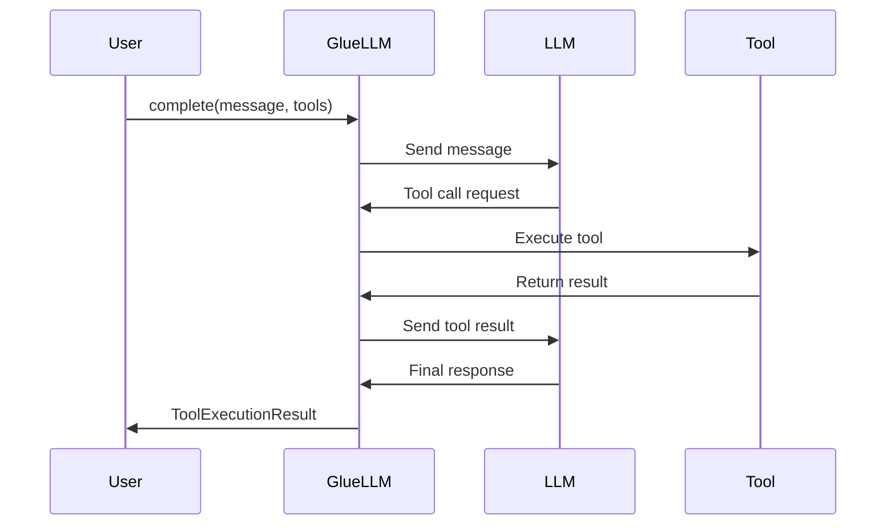
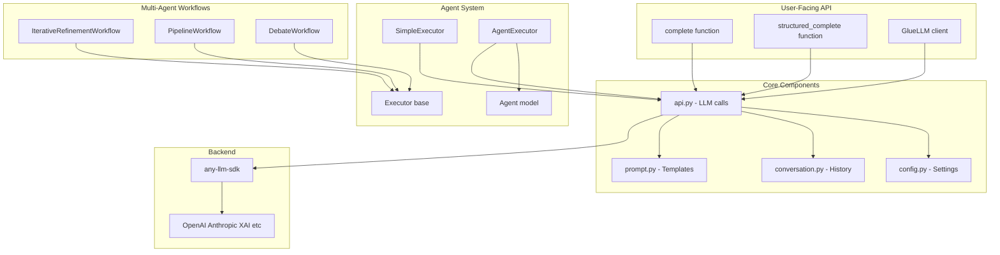
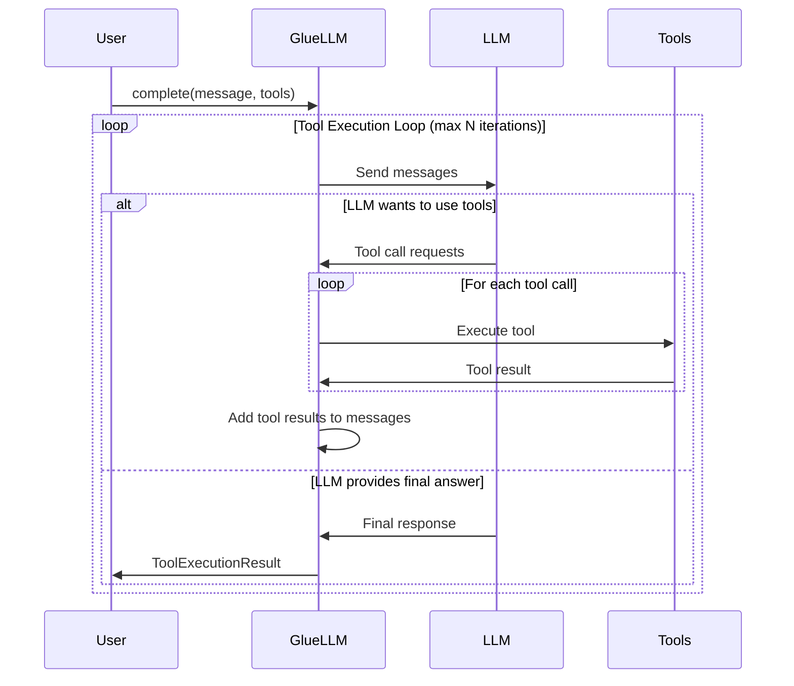

# GlueLLM

A high-level Python SDK for Large Language Models with automatic tool execution, structured output support, and multi-agent workflows.

## Features

- 🔄 **Automatic Tool Execution Loop** - No manual tool call handling required
- 📊 **Structured Output** - Type-safe responses with Pydantic models
- 💬 **Conversation Management** - Built-in multi-turn conversation support
- 🛠️ **Multiple Tools** - Easy integration of multiple tools (sync and async)
- 🎯 **Simple API** - Clean, intuitive interface for common LLM tasks
- 🔌 **Provider Agnostic** - Built on `any-llm-sdk` for multi-provider support
- ⚡ **Automatic Retry with Exponential Backoff** - Smart retry logic for rate limits and connection issues
- 🛡️ **Comprehensive Error Handling** - Catch and classify errors from any LLM provider
- 📝 **Enhanced Logging** - Track retry attempts and tool execution errors
- ⚙️ **Flexible Configuration** - Environment-based settings with pydantic-settings
- 🤖 **Multi-Agent Workflows** - Orchestrate multiple agents in iterative, pipeline, and debate patterns
- 🌊 **Streaming Support** - Real-time response streaming for better UX
- 📈 **Token Usage Tracking** - Monitor token consumption and costs
- 🔍 **OpenTelemetry Tracing** - Distributed tracing with MLflow for observability

## Installation

```bash
# Using uv (recommended)
uv pip install -e .

# With development dependencies
uv pip install -e ".[dev]"

# Requirements
# Python 3.12+
# See pyproject.toml for full dependencies
```

## Quick Start

### Simple Completion

```python
import asyncio
from gluellm.api import complete

async def main():
    result = await complete(
        user_message="What is the capital of France?",
        system_prompt="You are a helpful geography assistant.",
    )
    print(result.final_response)

asyncio.run(main())
```

### Tool Execution

```python
import asyncio
from gluellm.api import complete

def get_weather(location: str, unit: str = "celsius") -> str:
    """Get the current weather for a location.

    Args:
        location: City and country, e.g. "Tokyo, Japan"
        unit: Temperature unit ("celsius" or "fahrenheit")
    """
    return f"Weather in {location}: 22°{unit[0].upper()}, sunny"

async def main():
    result = await complete(
        user_message="What's the weather in Tokyo and Paris?",
        system_prompt="You are a weather assistant. Use get_weather for queries.",
        tools=[get_weather],
    )

    print(result.final_response)
    print(f"Tool calls made: {result.tool_calls_made}")

asyncio.run(main())
```

### Structured Output

```python
import asyncio
from gluellm.api import structured_complete
from pydantic import BaseModel, Field
from typing import Annotated

class PersonInfo(BaseModel):
    name: Annotated[str, Field(description="Full name")]
    age: Annotated[int, Field(description="Age in years")]
    city: Annotated[str, Field(description="City of residence")]

async def main():
    person = await structured_complete(
        user_message="Extract info: John Smith, 35, lives in Seattle",
        response_format=PersonInfo,
    )

    print(f"{person.name} is {person.age} years old and lives in {person.city}")

asyncio.run(main())
```

## Provider Support via any-llm-sdk

GlueLLM is built on top of [any-llm-sdk](https://github.com/BerkYeni/any_llm_client), which provides a unified interface to multiple LLM providers. This means you can easily switch between providers without changing your code.

### Supported Providers

- **OpenAI** - GPT-4, GPT-4o, GPT-3.5, etc.
- **Anthropic** - Claude 3.5 Sonnet, Claude 3 Opus, etc.
- **XAI** - Grok models
- **And more** - any-llm-sdk supports multiple providers

### Model Specification Format

Models are specified using the format: `provider:model_name`

```python
# OpenAI models
model="openai:gpt-4o-mini"
model="openai:gpt-4o"
model="openai:gpt-4-turbo"

# Anthropic models
model="anthropic:claude-3-5-sonnet-20241022"
model="anthropic:claude-3-opus-20240229"

# XAI models
model="xai:grok-beta"
```

### API Key Configuration

Each provider requires its own API key. Set them via environment variables:

```bash
# OpenAI
export OPENAI_API_KEY=sk-...

# Anthropic
export ANTHROPIC_API_KEY=sk-ant-...

# XAI
export XAI_API_KEY=xai-...
```

Alternatively, use the `GLUELLM_` prefixed variables:

```bash
export GLUELLM_OPENAI_API_KEY=sk-...
export GLUELLM_ANTHROPIC_API_KEY=sk-ant-...
export GLUELLM_XAI_API_KEY=xai-...
```

### Switching Providers

Switching between providers is as simple as changing the model string:

```python
# Use OpenAI
result = await complete(
    user_message="Hello!",
    model="openai:gpt-4o-mini",
)

# Switch to Anthropic
result = await complete(
    user_message="Hello!",
    model="anthropic:claude-3-5-sonnet-20241022",
)

# Switch to XAI
result = await complete(
    user_message="Hello!",
    model="xai:grok-beta",
)
```

All features (tool calling, structured output, conversations) work consistently across providers thanks to any-llm-sdk's unified interface.

### Default Provider

Set a default provider in your configuration to avoid specifying it every time:

```bash
# .env file
GLUELLM_DEFAULT_MODEL=openai:gpt-4o-mini
```

```python
from gluellm.api import complete

# Uses default model from config
result = await complete("Hello!")
```

### Why any-llm-sdk?

- **Unified API** - Same code works with any provider
- **Feature Parity** - Consistent tool calling and structured output
- **Easy Migration** - Switch providers without code changes
- **Future-Proof** - New providers added to any-llm-sdk work automatically

For more details on any-llm-sdk capabilities and supported providers, see the [any-llm-sdk documentation](https://github.com/BerkYeni/any_llm_client).

## Core API

### GlueLLM Client

The main client class for stateful LLM interactions with conversation memory.

```python
from gluellm.api import GlueLLM

client = GlueLLM(
    model="openai:gpt-4o-mini",          # Model in "provider:model" format
    system_prompt="You are helpful.",    # System prompt (optional)
    tools=[my_tool],                     # List of tools (optional)
    max_tool_iterations=10,              # Max tool execution loops (optional)
)

# Make completions with conversation memory
result = await client.complete("My favorite color is blue")
result = await client.complete("What's my favorite color?")  # Remembers context

# Structured completions
data = await client.structured_complete("Extract data...", response_format=MyModel)

# Reset conversation history
client.reset_conversation()
```

### Convenience Functions

For one-off requests without maintaining conversation state:

```python
from gluellm.api import complete, structured_complete

# Simple completion
result = await complete(
    user_message="What is 2+2?",
    model="openai:gpt-4o-mini",          # Optional, defaults to config
    system_prompt="You are helpful.",    # Optional
    tools=[calculator],                  # Optional
    execute_tools=True,                  # Optional, default True
    max_tool_iterations=10,              # Optional
)

# Structured completion
person = await structured_complete(
    user_message="Extract: Jane Doe, age 28",
    response_format=PersonInfo,
    model="openai:gpt-4o-mini",          # Optional
    system_prompt="Extract data.",       # Optional
)
```

### ToolExecutionResult

The result object returned by `complete()` and `client.complete()`:

```python
class ToolExecutionResult:
    final_response: str                      # Final text response from model
    tool_calls_made: int                     # Number of tool calls executed
    tool_execution_history: list[dict]       # Detailed tool call history
    raw_response: ChatCompletion | None      # Raw response from any-llm-sdk
    tokens_used: dict[str, int] | None       # Token usage info (prompt, completion, total)

# Access result data
result = await complete("Query with tools...", tools=[my_tool])
print(result.final_response)
print(f"Made {result.tool_calls_made} tool calls")

# Token usage tracking
if result.tokens_used:
    print(f"Tokens used: {result.tokens_used['total']}")
    print(f"  Prompt: {result.tokens_used['prompt']}")
    print(f"  Completion: {result.tokens_used['completion']}")

for exec_info in result.tool_execution_history:
    print(f"{exec_info['tool_name']}({exec_info['arguments']}) -> {exec_info['result']}")
```

## Tool Execution

### How It Works

GlueLLM automatically handles the tool execution loop:

1. Send user message to LLM
2. If LLM wants to call a tool, execute it
3. Send tool result back to LLM
4. Repeat until LLM provides final answer or max iterations reached

No manual tool call management required!



### Creating Tools

Tools are simple Python functions with docstrings:

```python
def calculate(expression: str) -> str:
    """Safely evaluate a mathematical expression.

    Args:
        expression: A mathematical expression like "2 + 2" or "10 * 5"

    Returns:
        The result of the calculation
    """
    try:
        result = eval(expression)  # Use safely in production!
        return str(result)
    except Exception as e:
        return f"Error: {str(e)}"
```

**Important:**
- Function name becomes the tool name
- Docstring is used by the LLM to understand tool purpose
- Type hints help the LLM understand parameters
- Return string values for best results
- Tools can be synchronous or asynchronous (use `async def` for async tools)

### Multiple Tools Example

```python
def get_weather(location: str) -> str:
    """Get current weather for a location."""
    return f"Weather in {location}: 22°C, sunny"

def get_time(timezone: str = "UTC") -> str:
    """Get current time in a timezone."""
    from datetime import datetime
    return datetime.now().strftime("%H:%M:%S")

result = await complete(
    user_message="What's the weather in Tokyo and what time is it there?",
    tools=[get_weather, get_time],
)
```

### Async Tools

Tools can be asynchronous for database queries, API calls, etc.:

```python
import aiohttp

async def fetch_data(url: str) -> str:
    """Fetch data from a URL."""
    async with aiohttp.ClientSession() as session:
        async with session.get(url) as response:
            return await response.text()

result = await complete(
    user_message="Fetch data from https://api.example.com/data",
    tools=[fetch_data],
)
```

GlueLLM automatically detects async tools and awaits them appropriately.

### Tool Execution History

Track all tool calls and their results:

```python
result = await complete("Complex query requiring tools...", tools=[tool1, tool2])

for i, exec_info in enumerate(result.tool_execution_history, 1):
    print(f"\nTool Call {i}:")
    print(f"  Tool: {exec_info['tool_name']}")
    print(f"  Args: {exec_info['arguments']}")
    print(f"  Result: {exec_info['result']}")
    print(f"  Error: {exec_info.get('error', False)}")
```

## Structured Output

Get type-safe, validated responses using Pydantic models:

```python
from pydantic import BaseModel, Field
from typing import Annotated

class Product(BaseModel):
    name: Annotated[str, Field(description="Product name")]
    price: Annotated[float, Field(description="Price in USD")]
    in_stock: Annotated[bool, Field(description="Whether item is in stock")]
    category: Annotated[str, Field(description="Product category")]

product = await structured_complete(
    user_message="Extract: iPhone 15 Pro, $999, available, Electronics",
    response_format=Product,
)

# Type-safe access
print(f"{product.name}: ${product.price}")
print(f"In stock: {product.in_stock}")
```

### Complex Structured Output

```python
from typing import List

class Address(BaseModel):
    street: str
    city: str
    country: str

class Person(BaseModel):
    name: str
    age: int
    addresses: List[Address]
    occupation: str | None = None

person = await structured_complete(
    user_message="""
    Extract: Sarah Johnson, 32 years old.
    Lives at 123 Main St, New York, USA and 456 Oak Ave, Boston, USA.
    Works as a software engineer.
    """,
    response_format=Person,
)
```

## Multi-turn Conversations

Use the `GlueLLM` client to maintain conversation context across multiple turns:

```python
from gluellm.api import GlueLLM

# Create client with conversation memory
client = GlueLLM(
    model="openai:gpt-4o-mini",
    system_prompt="You are a helpful assistant with memory.",
    tools=[calculator],  # Tools available across conversation
)

# Turn 1
result1 = await client.complete("My favorite number is 42")
print(result1.final_response)  # "I'll remember that your favorite number is 42!"

# Turn 2 - Has context from turn 1
result2 = await client.complete("What's my favorite number?")
print(result2.final_response)  # "Your favorite number is 42."

# Turn 3 - Can use tools with context
result3 = await client.complete("Calculate my favorite number times 2")
print(result3.final_response)  # "42 × 2 = 84"

# Reset conversation to start fresh
client.reset_conversation()
```

## Configuration

GlueLLM uses `pydantic-settings` for flexible configuration via environment variables or `.env` files.

### Configuration Options

```python
from gluellm.config import settings

# Access current settings
print(settings.default_model)           # "openai:gpt-4o-mini"
print(settings.max_tool_iterations)     # 10
print(settings.retry_max_attempts)      # 3
```

### Environment Variables

All settings can be configured via environment variables with the `GLUELLM_` prefix:

```bash
# Model settings
export GLUELLM_DEFAULT_MODEL=openai:gpt-4o-mini
export GLUELLM_DEFAULT_SYSTEM_PROMPT="You are a helpful assistant."

# Tool execution
export GLUELLM_MAX_TOOL_ITERATIONS=10

# Retry configuration
export GLUELLM_RETRY_MAX_ATTEMPTS=3
export GLUELLM_RETRY_MIN_WAIT=2
export GLUELLM_RETRY_MAX_WAIT=30
export GLUELLM_RETRY_MULTIPLIER=1

# Logging
export GLUELLM_LOG_LEVEL=INFO                    # Console log level (DEBUG, INFO, WARNING, ERROR, CRITICAL)
export GLUELLM_LOG_FILE_LEVEL=DEBUG              # File log level (typically DEBUG for full details)
export GLUELLM_LOG_DIR=logs                      # Log directory (default: logs/)
export GLUELLM_LOG_FILE_NAME=gluellm.log         # Log file name
export GLUELLM_LOG_JSON_FORMAT=false             # Enable JSON structured logging
export GLUELLM_LOG_MAX_BYTES=10485760            # Max log file size before rotation (10MB)
export GLUELLM_LOG_BACKUP_COUNT=5                # Number of backup log files to keep

# API Keys (optional - can also use provider-specific vars)
export GLUELLM_OPENAI_API_KEY=your-key
export GLUELLM_ANTHROPIC_API_KEY=your-key
export GLUELLM_XAI_API_KEY=your-key
```

### Using .env File

Create a `.env` file in your project root (see `env.example`):

```bash
# .env
GLUELLM_DEFAULT_MODEL=openai:gpt-4o-mini
GLUELLM_DEFAULT_SYSTEM_PROMPT=You are a helpful assistant.
GLUELLM_MAX_TOOL_ITERATIONS=10
GLUELLM_RETRY_MAX_ATTEMPTS=3
GLUELLM_LOG_LEVEL=INFO
```

### Reloading Configuration

```python
from gluellm.config import reload_settings

# Reload after changing .env file
settings = reload_settings()
```

## OpenTelemetry Tracing with MLflow

GlueLLM supports distributed tracing using OpenTelemetry and MLflow for comprehensive observability of LLM interactions. This feature enables you to:

- **Monitor LLM calls** with detailed span information
- **Track token usage** and costs
- **Trace tool executions** and their results
- **Debug complex workflows** with visualization
- **Analyze performance** across multiple calls

### Prerequisites

1. Install MLflow and OpenTelemetry dependencies:

```bash
pip install mlflow>=3.6.0 opentelemetry-api opentelemetry-sdk opentelemetry-exporter-otlp
```

2. Start MLflow tracking server:

```bash
# Start with SQLite backend (required for OTLP ingestion)
mlflow server --backend-store-uri sqlite:///mlflow.db --port 5000
```

**Note:** File-based backends do not support OpenTelemetry Protocol (OTLP) ingestion. Use a SQL-based backend (SQLite, PostgreSQL, MySQL).

### Configuration

Enable tracing by setting environment variables:

```bash
# Enable tracing
export GLUELLM_ENABLE_TRACING=true

# MLflow tracking server
export GLUELLM_MLFLOW_TRACKING_URI=http://localhost:5000
export GLUELLM_MLFLOW_EXPERIMENT_NAME=gluellm

# OpenTelemetry OTLP endpoint
export OTEL_EXPORTER_OTLP_ENDPOINT=http://localhost:5000/v1/traces
```

Or use a `.env` file:

```bash
# .env
GLUELLM_ENABLE_TRACING=true
GLUELLM_MLFLOW_TRACKING_URI=http://localhost:5000
GLUELLM_MLFLOW_EXPERIMENT_NAME=gluellm
OTEL_EXPORTER_OTLP_ENDPOINT=http://localhost:5000/v1/traces
```

### Usage

Once configured, tracing is automatic:

```python
import asyncio
from gluellm.api import complete
from gluellm.telemetry import configure_tracing

async def main():
    # Configure tracing on startup
    configure_tracing()

    # All LLM calls will be automatically traced
    result = await complete("What is the capital of France?")
    print(result.final_response)

asyncio.run(main())
```

### Viewing Traces

1. Open MLflow UI: `http://localhost:5000`
2. Navigate to the "Traces" tab
3. Click on a trace to see detailed execution information:
   - LLM call parameters (model, messages count)
   - Token usage (prompt, completion, total)
   - Tool executions and results
   - Error information if any
   - Execution duration

### Traced Attributes

GlueLLM automatically captures the following trace attributes:

**LLM Call Spans:**
- `llm.provider` - Provider name (openai, anthropic, etc.)
- `llm.model` - Model name
- `llm.messages_count` - Number of messages in the request
- `llm.tools_available` - Number of tools available
- `llm.tokens.prompt` - Prompt tokens used
- `llm.tokens.completion` - Completion tokens used
- `llm.tokens.total` - Total tokens used
- `llm.response.finish_reason` - Finish reason (stop, tool_calls, etc.)
- `llm.response.has_tool_calls` - Whether response includes tool calls

**Tool Execution Spans:**
- `tool.name` - Name of the executed tool
- `tool.arg_count` - Number of arguments passed
- `tool.success` - Whether execution succeeded
- `tool.error` - Error message if execution failed

### Example with Tool Tracing

```python
import asyncio
from gluellm.api import complete
from gluellm.telemetry import configure_tracing

def get_weather(location: str) -> str:
    """Get weather for a location."""
    return f"Weather in {location}: Sunny, 72°F"

async def main():
    configure_tracing()

    result = await complete(
        "What's the weather in San Francisco?",
        tools=[get_weather]
    )

    print(result.final_response)
    # Check MLflow UI to see both LLM call and tool execution traces

asyncio.run(main())
```

### Advanced: Custom Span Attributes

For custom instrumentation, use the tracing context:

```python
from gluellm.telemetry import trace_llm_call, set_span_attributes

async def custom_llm_call():
    with trace_llm_call(
        model="openai:gpt-4o-mini",
        messages=[{"role": "user", "content": "Hello"}],
        custom_attribute="custom_value"
    ) as span:
        # Your custom logic
        response = await some_llm_call()

        # Add custom attributes
        set_span_attributes(
            span,
            custom_metric=42,
            user_id="user-123"
        )

        return response
```

### Example Code

See `examples/opentelemetry_tracing.py` for comprehensive examples:

```bash
python examples/opentelemetry_tracing.py
```

This example demonstrates:
- Simple completions with tracing
- Tool execution tracing
- Structured output tracing
- Multi-turn conversation tracing
- Error handling with tracing

### Benefits

**Development:**
- Debug complex workflows visually
- Identify performance bottlenecks
- Track token usage and optimize costs
- Understand tool execution patterns

**Production:**
- Monitor system health in real-time
- Track LLM API reliability
- Measure end-to-end latency
- Correlate errors with specific calls

**Analysis:**
- Compare performance across models
- Analyze token usage patterns
- Optimize system prompts
- Identify frequently used tools

### Disabling Tracing

To disable tracing without changing code:

```bash
export GLUELLM_ENABLE_TRACING=false
```

Tracing has minimal overhead when disabled - the code checks a flag before instrumenting.

## Logging

GlueLLM includes production-grade logging with colored console output, file logging with rotation, and optional JSON structured logging for log aggregation tools.

### Features

- **Colored Console Logs** - Easy-to-read colored output for development (using `colorlog`)
- **File Logging** - Comprehensive DEBUG-level logs written to files for troubleshooting
- **Automatic Rotation** - Log files rotate by size (default: 10MB, keep 5 backups)
- **JSON Format Support** - Optional JSON structured logging for production monitoring
- **Environment Configuration** - Configure via environment variables or settings

### Default Configuration

Logging is automatically configured when you import GlueLLM:

- **Console**: INFO level with colored output
- **File**: DEBUG level in `logs/gluellm.log`
- **Rotation**: 10MB per file, 5 backup files
- **Format**: Human-readable text (JSON optional)

### Configuration

Configure logging via environment variables:

```bash
# Console log level
export GLUELLM_LOG_LEVEL=INFO              # DEBUG, INFO, WARNING, ERROR, CRITICAL

# File log level (typically DEBUG for full details)
export GLUELLM_LOG_FILE_LEVEL=DEBUG

# Log file location
export GLUELLM_LOG_DIR=logs                # Directory for log files
export GLUELLM_LOG_FILE_NAME=gluellm.log  # Log file name

# JSON structured logging (for log aggregation tools)
export GLUELLM_LOG_JSON_FORMAT=true        # Enable JSON format

# Log rotation
export GLUELLM_LOG_MAX_BYTES=10485760      # Max file size (10MB)
export GLUELLM_LOG_BACKUP_COUNT=5          # Number of backup files
```

Or configure programmatically:

```python
from gluellm.config import settings
from gluellm.logging_config import setup_logging

# Configure logging
setup_logging(
    log_level="INFO",
    log_file_level="DEBUG",
    log_dir="logs",
    log_file_name="gluellm.log",
    log_json_format=False,
    log_max_bytes=10 * 1024 * 1024,  # 10MB
    log_backup_count=5,
    force=True,  # Force reconfiguration
)
```

### Log Levels

- **DEBUG**: Detailed information for diagnosing problems (file only by default)
- **INFO**: General information about program execution (console default)
- **WARNING**: Something unexpected but handled gracefully
- **ERROR**: Serious problems that may allow the program to continue
- **CRITICAL**: Critical errors that may cause the program to abort

### Log File Location

By default, log files are written to the `logs/` directory in your project root:

```
logs/
├── gluellm.log        # Current log file
├── gluellm.log.1     # Rotated backup 1
├── gluellm.log.2     # Rotated backup 2
└── ...
```

### JSON Structured Logging

Enable JSON format for integration with log aggregation tools (ELK stack, Datadog, etc.):

```bash
export GLUELLM_LOG_JSON_FORMAT=true
```

JSON logs include structured fields for easy parsing:

```json
{
  "asctime": "2024-01-15 10:30:45",
  "name": "gluellm.api",
  "levelname": "INFO",
  "message": "LLM call completed",
  "model": "openai:gpt-4o-mini",
  "latency": 1.234,
  "tokens": {"total": 150, "prompt": 100, "completion": 50}
}
```

### Logging Utilities

GlueLLM provides utilities for enhanced logging:

```python
from gluellm.logging_utils import (
    log_function_call,
    log_async_function_call,
    log_timing,
    log_operation,
    get_logger,
)

# Automatic function logging decorator
@log_async_function_call(log_args=True, log_result=True)
async def my_function(x: int, y: int) -> int:
    return x + y

# Timing context manager
with log_timing("database_query"):
    result = await db.query(...)

# Operation context manager
with log_operation("file_processing"):
    process_file(...)

# Get configured logger
logger = get_logger(__name__)
logger.info("Custom log message")
```

### Example

See `examples/logging_example.py` for a complete logging demonstration:

```bash
python examples/logging_example.py
```

## Advanced APIs

### Conversation Management

GlueLLM provides a `Conversation` class for managing conversation history with fine-grained control:

```python
from gluellm.models.conversation import Conversation, Role, Message

# Create a conversation
conv = Conversation()

# Add messages
conv.add_message(Role.USER, "What is Python?")
conv.add_message(Role.ASSISTANT, "Python is a programming language.")

# Access messages
for msg in conv.messages:
    print(f"{msg.role.value}: {msg.content}")

# Convert to dictionary format for API calls
messages_dict = conv.messages_dict
# [{"role": "user", "content": "What is Python?"}, ...]

# Access conversation ID
print(conv.id)  # UUID string
```

**Message Roles:**
- `Role.SYSTEM` - System/instruction messages
- `Role.USER` - User input messages
- `Role.ASSISTANT` - LLM response messages
- `Role.TOOL` - Tool execution result messages

**Direct Message Creation:**
```python
from gluellm.models.conversation import Message, Role
import uuid

msg = Message(
    id=str(uuid.uuid4()),
    role=Role.USER,
    content="Hello!"
)
```

### Prompt Templating System

GlueLLM uses Jinja2 templates for system prompt formatting with automatic tool integration:

```python
from gluellm.models.prompt import SystemPrompt

# Create a system prompt
prompt = SystemPrompt(content="You are a helpful assistant.")

# Format with tools (automatically includes tool definitions)
def get_weather(location: str) -> str:
    """Get weather for a location."""
    return f"Weather in {location}: 22°C"

formatted = prompt.to_formatted_string(tools=[get_weather])
# Returns XML-formatted prompt with tool definitions
```

**Custom Templates:**

The system uses `BASE_SYSTEM_PROMPT` template which wraps instructions and tools in XML. The template automatically:
- Includes system instructions
- Lists available tools with names and docstrings
- Formats output as compact XML

**Template Structure:**
```xml
<system_prompt>
    <system_instructions>
        Your instructions here
    </system_instructions>
    <tools>
        <tool>
            <name>tool_name</name>
            <description>Tool docstring</description>
        </tool>
    </tools>
</system_prompt>
```

### Request Configuration

For advanced use cases, use `RequestConfig` to manage request parameters and conversation state:

```python
from gluellm.models.config import RequestConfig
from gluellm.models.prompt import SystemPrompt
from gluellm.models.conversation import Role
from pydantic import BaseModel

class OutputFormat(BaseModel):
    answer: str

# Create request configuration
config = RequestConfig(
    model="openai:gpt-4o-mini",
    system_prompt=SystemPrompt(content="You are helpful."),
    response_format=OutputFormat,  # Optional structured output
    tools=[get_weather],  # Optional tools
)

# Add messages to conversation
config.add_message_to_conversation(Role.USER, "What's the weather?")
config.add_message_to_conversation(Role.ASSISTANT, "Let me check...")

# Get formatted conversation (includes system message)
messages = config.get_conversation()
# Ready to pass to LLM API
```

**Use Cases:**
- Building custom request pipelines
- Managing conversation state outside GlueLLM client
- Integrating with other LLM libraries
- Advanced prompt engineering

### Workflow Configuration Models

Workflows use configuration models for fine-grained control:

**IterativeConfig** - Controls iterative refinement behavior:

```python
from gluellm.models.workflow import IterativeConfig

config = IterativeConfig(
    max_iterations=5,                    # Maximum refinement rounds
    min_quality_score=0.8,               # Early stopping threshold (0.0-1.0)
    convergence_threshold=0.05,           # Convergence detection (optional)
    quality_evaluator=my_evaluator_func, # Custom quality scorer (optional)
)

def my_evaluator_func(content: str, feedback: dict) -> float:
    """Custom quality evaluator returning 0.0-1.0."""
    # Analyze content and feedback
    return 0.85  # Quality score
```

**CriticConfig** - Defines critic agents in iterative workflows:

```python
from gluellm.models.workflow import CriticConfig
from gluellm.executors import AgentExecutor

critic_config = CriticConfig(
    executor=AgentExecutor(my_critic_agent),
    specialty="grammar and clarity",      # Critic's focus area
    goal="Optimize for readability",      # Specific optimization goal
    weight=1.0,                           # Feedback weight (default: 1.0)
)
```

**DebateConfig** - Controls debate workflow behavior:

```python
from gluellm.workflows.debate import DebateConfig

config = DebateConfig(
    max_rounds=5,                         # Maximum debate rounds
    require_consensus=False,              # Whether consensus is required
    judge_decides=True,                   # Whether judge makes final decision
)
```

### Generic Agent

GlueLLM provides a `GenericAgent` as a starting point for custom agents:

```python
from gluellm.agents.generic import GenericAgent

# Create a generic agent with default configuration
agent = GenericAgent()

# Access agent properties
print(agent.name)  # "Generic Agent"
print(agent.description)  # "A generic agent that can use any tool"

# Use in workflows
from gluellm.executors import AgentExecutor
executor = AgentExecutor(agent)
```

**Customization:**

You can subclass `GenericAgent` or use `Agent` directly for more control:

```python
from gluellm.models.agent import Agent
from gluellm.models.prompt import SystemPrompt

custom_agent = Agent(
    name="My Custom Agent",
    description="Does specific tasks",
    system_prompt=SystemPrompt(content="Custom instructions"),
    tools=[my_tool],
    max_tool_iterations=5,
    model="anthropic:claude-3-5-sonnet-20241022",  # Optional model override
)
```

## Multi-Agent Workflows

GlueLLM provides 15 powerful workflow patterns for orchestrating multiple agents, from simple single-agent refinement to complex multi-agent coordination patterns.

### Iterative Refinement Workflow

Producer agent creates content, critic agents provide parallel feedback, content is refined iteratively.

```python
from gluellm.workflows.iterative import IterativeRefinementWorkflow
from gluellm.models.workflow import IterativeConfig, CriticConfig
from gluellm.executors import AgentExecutor
from gluellm.models.agent import Agent
from gluellm.models.prompt import SystemPrompt

# Create producer (writer)
writer = Agent(
    name="Writer",
    description="Technical writer",
    system_prompt=SystemPrompt(
        content="You are a technical writer. Create clear, engaging content."
    ),
    tools=[],
    max_tool_iterations=5,
)

# Create critics
grammar_critic = Agent(
    name="Grammar Critic",
    description="Reviews grammar and clarity",
    system_prompt=SystemPrompt(
        content="You review grammar, spelling, and readability. Provide specific feedback."
    ),
    tools=[],
    max_tool_iterations=5,
)

style_critic = Agent(
    name="Style Critic",
    description="Reviews writing style",
    system_prompt=SystemPrompt(
        content="You review writing style, tone, and engagement. Provide specific feedback."
    ),
    tools=[],
    max_tool_iterations=5,
)

# Create workflow with multiple critics (execute in parallel)
workflow = IterativeRefinementWorkflow(
    producer=AgentExecutor(writer),
    critics=[
        CriticConfig(
            executor=AgentExecutor(grammar_critic),
            specialty="grammar and clarity",
            goal="Optimize for readability and eliminate errors",
        ),
        CriticConfig(
            executor=AgentExecutor(style_critic),
            specialty="writing style",
            goal="Ensure engaging, well-structured narrative",
        ),
    ],
    config=IterativeConfig(max_iterations=3),
)

# Execute workflow
result = await workflow.execute("Write a short article about Python async programming")

print(f"Final output after {result.iterations} iterations:")
print(result.final_output)
print(f"\nConverged: {result.metadata.get('converged', False)}")
print(f"Total interactions: {len(result.agent_interactions)}")
```

**Key Features:**
- Multiple critics execute in parallel for efficiency
- Each critic has a specialty and goal
- Iterates until convergence or max iterations
- Optional quality evaluator for early stopping

### Pipeline Workflow

Agents execute sequentially, output of one becomes input to the next.

```python
from gluellm.workflows.pipeline import PipelineWorkflow
from gluellm.executors import AgentExecutor
from gluellm.models.agent import Agent
from gluellm.models.prompt import SystemPrompt

# Create pipeline stages
researcher = Agent(
    name="Researcher",
    description="Researches topics",
    system_prompt=SystemPrompt(
        content="You gather and organize information. Provide comprehensive research."
    ),
    tools=[],
)

writer = Agent(
    name="Writer",
    description="Writes content",
    system_prompt=SystemPrompt(
        content="You write clear, engaging content based on research provided."
    ),
    tools=[],
)

editor = Agent(
    name="Editor",
    description="Edits content",
    system_prompt=SystemPrompt(
        content="You review and polish written content to improve clarity and quality."
    ),
    tools=[],
)

# Create pipeline
workflow = PipelineWorkflow(
    stages=[
        ("research", AgentExecutor(researcher)),
        ("write", AgentExecutor(writer)),
        ("edit", AgentExecutor(editor)),
    ]
)

# Execute pipeline
result = await workflow.execute("Topic: The benefits of async programming in Python")

print(f"Completed {result.iterations} stages")
print(f"Final output:\n{result.final_output}")

# View stage outputs
for interaction in result.agent_interactions:
    print(f"\nStage: {interaction['stage']}")
    print(f"Output: {interaction['output'][:100]}...")
```

**Key Features:**
- Sequential execution (stage N gets output from stage N-1)
- Named stages for tracking
- Simple and predictable flow

### Debate Workflow

Multiple agents debate a topic, optional judge makes final decision.

```python
from gluellm.workflows.debate import DebateWorkflow, DebateConfig
from gluellm.executors import AgentExecutor
from gluellm.models.agent import Agent
from gluellm.models.prompt import SystemPrompt

# Create debaters
pro_agent = Agent(
    name="Proponent",
    description="Argues in favor",
    system_prompt=SystemPrompt(
        content="You argue in favor of positions with strong, logical arguments."
    ),
    tools=[],
)

con_agent = Agent(
    name="Opponent",
    description="Argues against",
    system_prompt=SystemPrompt(
        content="You argue against positions with strong counter-arguments."
    ),
    tools=[],
)

judge_agent = Agent(
    name="Judge",
    description="Evaluates arguments",
    system_prompt=SystemPrompt(
        content="You are an impartial judge. Evaluate arguments and make fair decisions."
    ),
    tools=[],
)

# Create debate workflow
workflow = DebateWorkflow(
    participants=[
        ("Pro", AgentExecutor(pro_agent)),
        ("Con", AgentExecutor(con_agent)),
    ],
    judge=AgentExecutor(judge_agent),
    config=DebateConfig(
        max_rounds=3,
        judge_decides=True,
    ),
)

# Execute debate
result = await workflow.execute("Should AI development be regulated by governments?")

print(f"Debate completed in {result.iterations} rounds")
print(f"Judge decision:\n{result.final_output}")
print(f"\nTotal interactions: {len(result.agent_interactions)}")
```

**Key Features:**
- Multiple participants in round-robin debate
- Each participant sees previous arguments
- Optional judge for final decision
- Debate history tracking

### Reflection Workflow

Single agent critiques and improves its own output through self-reflection.

```python
from gluellm.workflows.reflection import ReflectionWorkflow, ReflectionConfig
from gluellm.executors import AgentExecutor

workflow = ReflectionWorkflow(
    generator=AgentExecutor(generator_agent),
    reflector=AgentExecutor(reflector_agent),  # Optional, defaults to generator
    config=ReflectionConfig(max_reflections=3),
)

result = await workflow.execute("Write an article about Python")
```

**Key Features:**
- Self-critique and improvement loop
- Optional improvement threshold for early stopping
- Custom reflection prompt templates

### Chain of Density Workflow

Iteratively increases content density by adding entities, details, or examples.

```python
from gluellm.workflows.chain_of_density import ChainOfDensityWorkflow, ChainOfDensityConfig

workflow = ChainOfDensityWorkflow(
    generator=AgentExecutor(generator_agent),
    config=ChainOfDensityConfig(
        num_iterations=5,
        density_increment="entities",  # or "details" or "examples"
        preserve_length=True,
    ),
)

result = await workflow.execute("Summarize this article")
```

**Key Features:**
- Progressive density increase
- Optional length preservation
- Multiple increment strategies

### Socratic Workflow

Two agents engage in question-answer dialogue to explore topics deeply.

```python
from gluellm.workflows.socratic import SocraticWorkflow, SocraticConfig

workflow = SocraticWorkflow(
    questioner=AgentExecutor(questioner_agent),
    responder=AgentExecutor(responder_agent),
    config=SocraticConfig(
        max_exchanges=5,
        mode="peer",  # or "teacher_student"
        synthesis_at_end=True,
    ),
)

result = await workflow.execute("What is artificial intelligence?")
```

**Key Features:**
- Teacher-student or peer-to-peer modes
- Optional synthesis at end
- Deep exploration through questioning

### RAG Workflow

Retrieval-Augmented Generation with optional fact verification.

```python
from gluellm.workflows.rag import RAGWorkflow, RAGConfig

def my_retriever(query: str) -> list[dict]:
    # Your retrieval logic
    return [
        {"content": "Relevant context...", "source": "doc1"},
        {"content": "More context...", "source": "doc2"},
    ]

workflow = RAGWorkflow(
    retriever=my_retriever,
    generator=AgentExecutor(generator_agent),
    verifier=AgentExecutor(verifier_agent),  # Optional
    config=RAGConfig(
        max_retrieved_chunks=5,
        include_sources=True,
        verify_facts=True,
    ),
)

result = await workflow.execute("What is Python?")
```

**Key Features:**
- Custom retrieval function
- Optional fact verification
- Source attribution
- Fallback on no context

### Round-Robin Workflow

Multiple agents take turns contributing collaboratively.

```python
from gluellm.workflows.round_robin import RoundRobinWorkflow, RoundRobinConfig

workflow = RoundRobinWorkflow(
    agents=[
        ("Writer", AgentExecutor(writer_agent)),
        ("Editor", AgentExecutor(editor_agent)),
        ("Reviewer", AgentExecutor(reviewer_agent)),
    ],
    config=RoundRobinConfig(
        max_rounds=3,
        contribution_style="extend",  # or "refine" or "challenge"
        final_synthesis=True,
    ),
)

result = await workflow.execute("Write an article about AI")
```

**Key Features:**
- Sequential contribution rounds
- Multiple contribution styles
- Optional final synthesis

### Consensus Workflow

Multiple agents propose solutions and iterate until consensus.

```python
from gluellm.workflows.consensus import ConsensusWorkflow, ConsensusConfig

workflow = ConsensusWorkflow(
    proposers=[
        ("Agent1", AgentExecutor(agent1)),
        ("Agent2", AgentExecutor(agent2)),
        ("Agent3", AgentExecutor(agent3)),
    ],
    config=ConsensusConfig(
        min_agreement_ratio=0.7,
        max_rounds=5,
        voting_strategy="majority",  # or "unanimous" or "weighted"
    ),
)

result = await workflow.execute("Design a solution for X")
```

**Key Features:**
- Proposal and voting mechanism
- Configurable agreement threshold
- Multiple voting strategies

### Hierarchical Workflow

Manager breaks down tasks, workers execute, manager synthesizes.

```python
from gluellm.workflows.hierarchical import HierarchicalWorkflow, HierarchicalConfig

workflow = HierarchicalWorkflow(
    manager=AgentExecutor(manager_agent),
    workers=[
        ("Worker1", AgentExecutor(worker1)),
        ("Worker2", AgentExecutor(worker2)),
    ],
    config=HierarchicalConfig(
        max_subtasks=5,
        parallel_workers=True,
        synthesis_strategy="summarize",  # or "concatenate" or "merge"
    ),
)

result = await workflow.execute("Research and write a report on AI")
```

**Key Features:**
- Task decomposition
- Parallel or sequential worker execution
- Multiple synthesis strategies

### MapReduce Workflow

Parallel map phase processes chunks, reduce phase aggregates results.

```python
from gluellm.workflows.map_reduce import MapReduceWorkflow, MapReduceConfig

workflow = MapReduceWorkflow(
    mapper=AgentExecutor(mapper_agent),
    reducer=AgentExecutor(reducer_agent),  # Optional, defaults to mapper
    config=MapReduceConfig(
        chunk_size=1000,
        chunk_overlap=100,
        max_parallel_chunks=5,
        reduce_strategy="summarize",  # or "concatenate" or "hierarchical"
    ),
)

result = await workflow.execute("Process this long document...")
```

**Key Features:**
- Automatic chunking
- Parallel processing
- Multiple reduce strategies

### ReAct Workflow

Reasoning + Acting pattern with interleaved thought/action steps.

```python
from gluellm.workflows.react import ReActWorkflow, ReActConfig

workflow = ReActWorkflow(
    reasoner=AgentExecutor(reasoner_agent),
    config=ReActConfig(
        max_steps=10,
        stop_on_final_answer=True,
    ),
)

result = await workflow.execute("What is the weather in Paris?")
```

**Key Features:**
- Interleaved reasoning and action
- Tool-using pattern
- Automatic final answer detection

### Mixture of Experts Workflow

Routes queries to specialized experts and combines outputs.

```python
from gluellm.workflows.mixture_of_experts import (
    MixtureOfExpertsWorkflow,
    ExpertConfig,
    MoEConfig,
)

workflow = MixtureOfExpertsWorkflow(
    experts=[
        ExpertConfig(
            executor=AgentExecutor(math_expert),
            specialty="mathematics",
            description="Expert in math and calculations",
            activation_keywords=["calculate", "math", "equation"],
        ),
        ExpertConfig(
            executor=AgentExecutor(code_expert),
            specialty="programming",
            description="Expert in coding",
            activation_keywords=["code", "program"],
        ),
    ],
    config=MoEConfig(
        routing_strategy="keyword",  # or "semantic", "all", "top_k"
        top_k=2,
        combine_strategy="synthesize",  # or "concatenate" or "vote"
    ),
)

result = await workflow.execute("Calculate the factorial of 10")
```

**Key Features:**
- Multiple routing strategies
- Specialized expert agents
- Flexible combination methods

### Constitutional Workflow

Generates content, checks against principles, revises until satisfied.

```python
from gluellm.workflows.constitutional import (
    ConstitutionalWorkflow,
    ConstitutionalConfig,
    Principle,
)

workflow = ConstitutionalWorkflow(
    generator=AgentExecutor(generator_agent),
    critic=AgentExecutor(critic_agent),  # Optional, defaults to generator
    config=ConstitutionalConfig(
        principles=[
            Principle(
                name="harmless",
                description="Content should not cause harm",
                severity="critical",
            ),
            Principle(
                name="helpful",
                description="Content should be helpful",
                severity="error",
            ),
        ],
        max_revisions=3,
        require_all_pass=True,
    ),
)

result = await workflow.execute("Write a response about AI safety")
```

**Key Features:**
- Principle-based critique
- Severity levels
- Automatic revision loop

### Tree of Thoughts Workflow

Explores multiple reasoning paths, evaluates and selects best.

```python
from gluellm.workflows.tree_of_thoughts import (
    TreeOfThoughtsWorkflow,
    TreeOfThoughtsConfig,
)

workflow = TreeOfThoughtsWorkflow(
    thinker=AgentExecutor(thinker_agent),
    evaluator=AgentExecutor(evaluator_agent),  # Optional, defaults to thinker
    config=TreeOfThoughtsConfig(
        branching_factor=3,
        max_depth=3,
        evaluation_strategy="score",  # or "vote" or "best_first"
        prune_threshold=0.3,
    ),
)

result = await workflow.execute("Solve this complex problem...")
```

**Key Features:**
- Multiple reasoning paths
- Evaluation and pruning
- Best-first exploration

## Agents and Executors

### Agent Model

An `Agent` represents a configured LLM with specific capabilities:

```python
from gluellm.models.agent import Agent
from gluellm.models.prompt import SystemPrompt

agent = Agent(
    name="Research Assistant",
    description="Helps with research tasks",
    system_prompt=SystemPrompt(content="You are a research assistant."),
    tools=[search_web, summarize_text],
    max_tool_iterations=10,
    model="openai:gpt-4o-mini",  # Optional, defaults to config
)
```

### Executors

Executors run agents or direct LLM queries:

**SimpleExecutor** - Direct LLM execution:

```python
from gluellm.executors import SimpleExecutor

executor = SimpleExecutor(
    model="openai:gpt-4o-mini",
    system_prompt="You are helpful.",
    tools=[calculator],
    max_tool_iterations=5,
)

response = await executor.execute("What is 25 * 4?")
print(response)
```

**AgentExecutor** - Execute using a pre-configured Agent:

```python
from gluellm.executors import AgentExecutor
from gluellm.models.agent import Agent
from gluellm.models.prompt import SystemPrompt

agent = Agent(
    name="Assistant",
    description="Helpful agent",
    system_prompt=SystemPrompt(content="You are helpful."),
    tools=[],
)

executor = AgentExecutor(agent=agent)
response = await executor.execute("Hello!")
print(response)
```

**Use Cases:**
- `SimpleExecutor`: Quick, one-off tasks with minimal setup
- `AgentExecutor`: Workflows with pre-configured, reusable agents

## Error Handling

GlueLLM provides comprehensive error handling with automatic classification and retry logic.

### Exception Hierarchy

```python
from gluellm.api import (
    LLMError,              # Base exception
    TokenLimitError,       # Token/context length exceeded
    RateLimitError,        # Rate limit hit (429)
    APIConnectionError,    # Network/connection issues (5xx)
    InvalidRequestError,   # Bad request parameters (400)
    AuthenticationError,   # Authentication failed (401/403)
)
```

### Handling Errors

```python
from gluellm.api import complete, TokenLimitError, RateLimitError

try:
    result = await complete(
        user_message="Very long query...",
        tools=[my_tool],
    )
except TokenLimitError as e:
    print(f"Token limit exceeded: {e}")
    # Handle by reducing input size
except RateLimitError as e:
    print(f"Rate limit hit after retries: {e}")
    # Handle by backing off further
except AuthenticationError as e:
    print(f"Auth failed: {e}")
    # Check API keys
except APIConnectionError as e:
    print(f"Connection error after retries: {e}")
    # Check network/service status
except InvalidRequestError as e:
    print(f"Invalid request: {e}")
    # Check parameters
```

### Automatic Retry

GlueLLM automatically retries transient errors with exponential backoff:

**Retryable Errors:**
- `RateLimitError` - Rate limit hit (429)
- `APIConnectionError` - Connection issues (5xx)

**Non-Retryable Errors:**
- `TokenLimitError` - Need to reduce input
- `AuthenticationError` - Need to fix credentials
- `InvalidRequestError` - Need to fix parameters

**Retry Configuration:**

```python
# Via environment variables
export GLUELLM_RETRY_MAX_ATTEMPTS=3    # Max retry attempts
export GLUELLM_RETRY_MIN_WAIT=2        # Min wait between retries (seconds)
export GLUELLM_RETRY_MAX_WAIT=30       # Max wait between retries (seconds)
export GLUELLM_RETRY_MULTIPLIER=1      # Exponential backoff multiplier
```

The retry logic uses exponential backoff: if a request fails with a retryable error, GlueLLM waits before retrying, with wait times increasing exponentially up to the max wait time.

## CLI Reference

GlueLLM includes a comprehensive CLI for testing and demonstrations.

### Available Commands

After installation, use the `gluellm` command:

```bash
# Test basic completion
gluellm test-completion

# Test tool calling
gluellm test-tool-call

# Run all interactive demos
gluellm demo

# Run example scripts
gluellm examples

# Run test suite
gluellm run-tests
gluellm run-tests --verbose
gluellm run-tests -c TestBasicToolCalling
gluellm run-tests -t test_single_tool_call
gluellm run-tests --no-integration
```

### Workflow Test Commands

```bash
# Test iterative refinement workflow
gluellm test-iterative-workflow
gluellm test-iterative-workflow -i "Write about AI" -n 3 -c 2

# Test pipeline workflow
gluellm test-pipeline-workflow
gluellm test-pipeline-workflow -i "Topic: Python" -s 3

# Test debate workflow
gluellm test-debate-workflow
gluellm test-debate-workflow -t "Is remote work better?" -r 3 --no-judge
```

**Legacy Usage:** If the `gluellm` command is not available, you can use `python -m gluellm.cli` or `python source/cli.py` (deprecated).

## Architecture



### Tool Execution Flow



## Deployment & Production

### Environment Setup

For production deployments, use environment variables or a secure configuration management system:

```bash
# Production environment variables
export GLUELLM_DEFAULT_MODEL=openai:gpt-4o-mini
export GLUELLM_MAX_TOOL_ITERATIONS=10
export GLUELLM_RETRY_MAX_ATTEMPTS=3
export GLUELLM_LOG_LEVEL=INFO

# API Keys (use secrets management in production)
export OPENAI_API_KEY=sk-...
# or
export GLUELLM_OPENAI_API_KEY=sk-...
```

### Docker Deployment

Create a `Dockerfile`:

```dockerfile
FROM python:3.12-slim

WORKDIR /app

# Install uv for dependency management
RUN pip install uv

# Copy dependency files
COPY pyproject.toml uv.lock ./

# Install dependencies
RUN uv pip install --system -e .

# Copy application code
COPY gluellm/ ./gluellm/
COPY examples/ ./examples/

# Set environment variables
ENV PYTHONUNBUFFERED=1
ENV GLUELLM_LOG_LEVEL=INFO

# Run your application
CMD ["python", "your_app.py"]
```

Build and run:

```bash
docker build -t gluellm-app .
docker run -e OPENAI_API_KEY=sk-... gluellm-app
```

### Docker Compose

Example `docker-compose.yml`:

```yaml
version: '3.8'

services:
  gluellm-app:
    build: .
    environment:
      - GLUELLM_DEFAULT_MODEL=openai:gpt-4o-mini
      - GLUELLM_LOG_LEVEL=INFO
      - OPENAI_API_KEY=${OPENAI_API_KEY}
    volumes:
      - ./logs:/app/logs
    restart: unless-stopped
```

### Production Considerations

**1. API Key Management**
- Use secrets management (AWS Secrets Manager, HashiCorp Vault, etc.)
- Never commit API keys to version control
- Rotate keys regularly
- Use least-privilege access

**2. Error Handling**
- Implement comprehensive error handling
- Set up monitoring and alerting
- Log errors for debugging
- Provide fallback responses for users

**3. Rate Limiting**
- Implement rate limiting for your application
- Monitor API usage and costs
- Use retry configuration appropriately
- Consider caching responses when possible

**4. Logging**
- Configure structured logging
- Log to files or centralized logging service
- Include request IDs for tracing
- Don't log sensitive data (API keys, PII)

**5. Performance**
- Use connection pooling for external APIs
- Implement caching for repeated queries
- Monitor token usage and optimize prompts
- Consider async/await for concurrent operations

**6. Security**
- Validate all inputs
- Sanitize tool outputs
- Use HTTPS for all API calls
- Implement authentication/authorization
- Regular security updates

**7. Scaling**
- Use load balancers for multiple instances
- Consider message queues for async processing
- Monitor resource usage
- Scale horizontally as needed

### Example Production Application

```python
"""Production-ready GlueLLM application."""

import asyncio
import logging
import os
from contextlib import asynccontextmanager

from gluellm.api import GlueLLM, RateLimitError, TokenLimitError

# Configure logging
logging.basicConfig(
    level=os.getenv("GLUELLM_LOG_LEVEL", "INFO"),
    format="%(asctime)s - %(name)s - %(levelname)s - %(message)s"
)
logger = logging.getLogger(__name__)


class ProductionLLMService:
    """Production LLM service with error handling and monitoring."""

    def __init__(self):
        self.client = GlueLLM(
            model=os.getenv("GLUELLM_DEFAULT_MODEL", "openai:gpt-4o-mini"),
            system_prompt=os.getenv("GLUELLM_DEFAULT_SYSTEM_PROMPT", "You are helpful."),
            max_tool_iterations=int(os.getenv("GLUELLM_MAX_TOOL_ITERATIONS", "10")),
        )

    async def process_request(self, user_message: str) -> dict:
        """Process a user request with comprehensive error handling."""
        try:
            result = await self.client.complete(user_message)
            return {
                "success": True,
                "response": result.final_response,
                "tool_calls": result.tool_calls_made,
            }
        except RateLimitError as e:
            logger.warning(f"Rate limit hit: {e}")
            return {
                "success": False,
                "error": "Service temporarily unavailable. Please try again later.",
            }
        except TokenLimitError as e:
            logger.error(f"Token limit exceeded: {e}")
            return {
                "success": False,
                "error": "Request too long. Please shorten your message.",
            }
        except Exception as e:
            logger.error(f"Unexpected error: {e}", exc_info=True)
            return {
                "success": False,
                "error": "An error occurred. Please try again.",
            }


# Usage
async def main():
    service = ProductionLLMService()
    result = await service.process_request("Hello!")
    print(result)


if __name__ == "__main__":
    asyncio.run(main())
```

### Monitoring & Observability

- **Metrics**: Track request counts, latency, error rates
- **Logging**: Structured logs with correlation IDs
- **Alerting**: Set up alerts for high error rates or rate limits
- **Cost Monitoring**: Track token usage and API costs

### CI/CD Integration

Example GitHub Actions workflow:

```yaml
name: Deploy GlueLLM App

on:
  push:
    branches: [main]

jobs:
  deploy:
    runs-on: ubuntu-latest
    steps:
      - uses: actions/checkout@v3
      - uses: actions/setup-python@v4
        with:
          python-version: '3.12'
      - name: Install dependencies
        run: |
          pip install uv
          uv pip install -e ".[dev]"
      - name: Run tests
        run: uv run pytest tests/ -m "not integration"
      - name: Deploy
        run: |
          # Your deployment steps
```

## Development

### Running Tests

```bash
# Run all tests
uv run pytest tests/

# Run specific test file
uv run pytest tests/test_api.py

# Run with verbose output
uv run pytest tests/ -v

# Run specific test
uv run pytest tests/test_api.py::test_simple_completion

# Skip integration tests
uv run pytest tests/ -m "not integration"

# Using the CLI
gluellm run-tests
gluellm run-tests --verbose
```

### Running Examples

```bash
# Run all examples
uv run python examples/basic_usage.py

# Run CLI demos
gluellm demo

# Run specific workflow examples
gluellm test-iterative-workflow
gluellm test-pipeline-workflow
gluellm test-debate-workflow
```

### Project Structure

```
gluellm/
├── gluellm/                     # Main package (use this)
│   ├── api.py                   # Core API (GlueLLM, complete, structured_complete)
│   ├── cli.py                   # Command-line interface
│   ├── config.py                # Configuration management
│   ├── models/
│   │   ├── agent.py            # Agent model
│   │   ├── config.py           # Request configuration
│   │   ├── conversation.py     # Conversation and message models
│   │   ├── prompt.py           # Prompt templates
│   │   └── workflow.py         # Workflow configurations
│   ├── executors/
│   │   ├── _base.py            # Executor interface
│   │   └── __init__.py         # SimpleExecutor, AgentExecutor
│   ├── workflows/
│   │   ├── _base.py            # Workflow base class
│   │   ├── iterative.py        # Iterative refinement workflow
│   │   ├── pipeline.py         # Pipeline workflow
│   │   └── debate.py           # Debate workflow
│   └── agents/
│       └── generic.py          # Generic agent implementation
├── source/                      # Legacy/alternate CLI location (deprecated)
│   └── cli.py                   # Use 'gluellm' command instead
├── examples/
│   ├── basic_usage.py           # Usage examples
│   ├── configuration_example.py # Configuration examples
│   ├── error_handling_example.py # Error handling examples
│   └── workflow_example.py      # Workflow examples
├── tests/
│   ├── test_api.py              # API tests
│   ├── test_cli.py              # CLI tests
│   ├── test_workflows.py        # Workflow tests
│   ├── test_error_handling.py   # Error handling tests
│   └── test_llm_edge_cases.py   # LLM integration tests
├── pyproject.toml               # Project configuration
├── env.example                  # Example environment configuration
├── LICENSE                      # MIT License
├── CONTRIBUTING.md              # Contribution guidelines
├── CHANGELOG.md                 # Version history
├── SECURITY.md                  # Security policy
└── README.md                    # This file
```

**Note:** The `source/` directory contains legacy CLI code. The main package is `gluellm/`. Use the `gluellm` CLI command (after installation) instead of `python source/cli.py`.

### Code Quality

```bash
# Format code with ruff
uv run ruff format .

# Lint code
uv run ruff check .

# Run pre-commit hooks
uv run pre-commit run --all-files
```

## Requirements

- **Python:** 3.12+
- **Core Dependencies:**
  - `any-llm-sdk[openai]>=1.5.0` - Multi-provider LLM support
  - `pydantic>=2.12.5` - Data validation and structured output
  - `pydantic-settings>=2.12.0` - Configuration management
  - `tenacity>=9.0.0` - Retry logic with exponential backoff
  - `click>=8.3.1` - CLI framework
  - `rich>=14.2.0` - Terminal formatting
  - `jinja2>=3.1.6` - Prompt templating

See [pyproject.toml](pyproject.toml) for complete dependency list.

## Contributing

1. Follow the existing code style (enforced by `ruff`)
2. Add tests for new features
3. Update documentation as needed
4. Run tests and linters before submitting
5. Use conventional commit messages

```bash
# Setup development environment
uv pip install -e ".[dev]"
uv run pre-commit install

# Before committing
uv run pytest tests/
uv run ruff check .
uv run ruff format .
```

## License

[Add your license here]

## Credits

Built on top of [any-llm-sdk](https://github.com/BerkYeni/any_llm_client) for multi-provider LLM support.

---

**Need Help?** Check out the [examples/](examples/) directory for more usage patterns, or run `gluellm demo` to see interactive demonstrations of all features.
