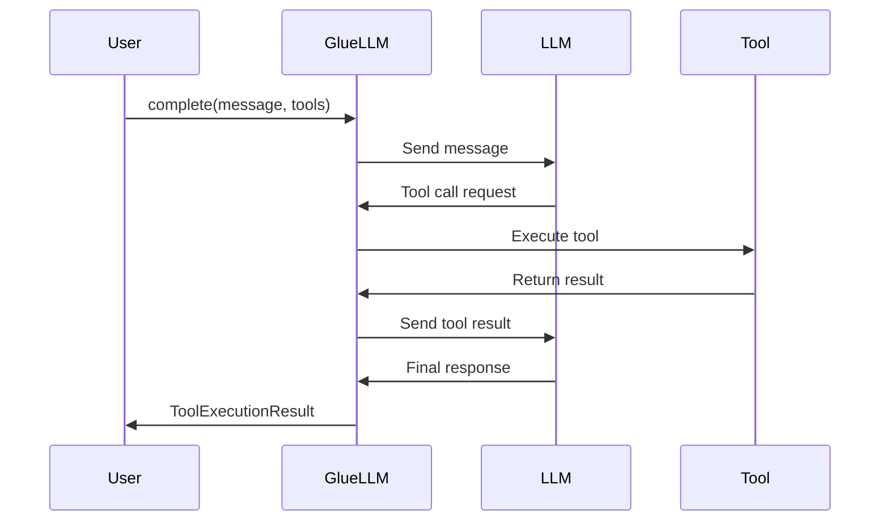
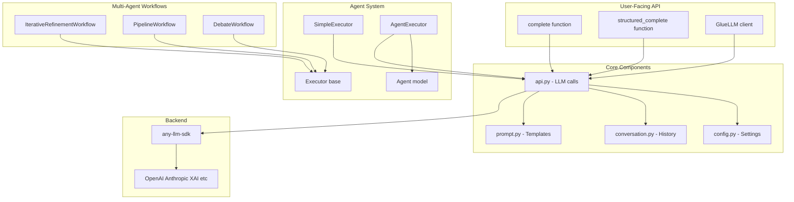
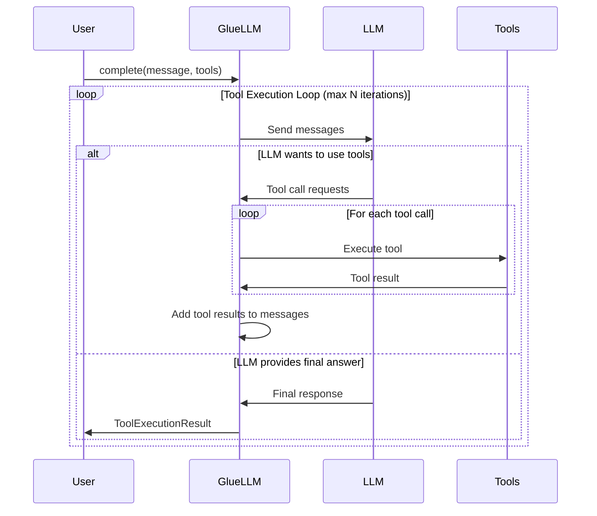

# GlueLLM

A high-level Python SDK for Large Language Models with automatic tool execution, structured output support, and multi-agent workflows.

## Features

- 🔄 **Automatic Tool Execution Loop** - No manual tool call handling required
- 📊 **Structured Output** - Type-safe responses with Pydantic models
- 💬 **Conversation Management** - Built-in multi-turn conversation support
- 🛠️ **Multiple Tools** - Easy integration of multiple tools
- 🎯 **Simple API** - Clean, intuitive interface for common LLM tasks
- 🔌 **Provider Agnostic** - Built on `any-llm-sdk` for multi-provider support
- ⚡ **Automatic Retry with Exponential Backoff** - Smart retry logic for rate limits and connection issues
- 🛡️ **Comprehensive Error Handling** - Catch and classify errors from any LLM provider
- 📝 **Enhanced Logging** - Track retry attempts and tool execution errors
- ⚙️ **Flexible Configuration** - Environment-based settings with pydantic-settings
- 🤖 **Multi-Agent Workflows** - Orchestrate multiple agents in iterative, pipeline, and debate patterns

## Installation

```bash
# Using uv (recommended)
uv pip install -e .

# With development dependencies
uv pip install -e ".[dev]"

# Requirements
# Python 3.12+
# See pyproject.toml for full dependencies
```

## Quick Start

### Simple Completion

```python
import asyncio
from gluellm.api import complete

async def main():
    result = await complete(
        user_message="What is the capital of France?",
        system_prompt="You are a helpful geography assistant.",
    )
    print(result.final_response)

asyncio.run(main())
```

### Tool Execution

```python
import asyncio
from gluellm.api import complete

def get_weather(location: str, unit: str = "celsius") -> str:
    """Get the current weather for a location.

    Args:
        location: City and country, e.g. "Tokyo, Japan"
        unit: Temperature unit ("celsius" or "fahrenheit")
    """
    return f"Weather in {location}: 22°{unit[0].upper()}, sunny"

async def main():
    result = await complete(
        user_message="What's the weather in Tokyo and Paris?",
        system_prompt="You are a weather assistant. Use get_weather for queries.",
        tools=[get_weather],
    )

    print(result.final_response)
    print(f"Tool calls made: {result.tool_calls_made}")

asyncio.run(main())
```

### Structured Output

```python
import asyncio
from gluellm.api import structured_complete
from pydantic import BaseModel, Field
from typing import Annotated

class PersonInfo(BaseModel):
    name: Annotated[str, Field(description="Full name")]
    age: Annotated[int, Field(description="Age in years")]
    city: Annotated[str, Field(description="City of residence")]

async def main():
    person = await structured_complete(
        user_message="Extract info: John Smith, 35, lives in Seattle",
        response_format=PersonInfo,
    )

    print(f"{person.name} is {person.age} years old and lives in {person.city}")

asyncio.run(main())
```

## Provider Support via any-llm-sdk

GlueLLM is built on top of [any-llm-sdk](https://github.com/BerkYeni/any_llm_client), which provides a unified interface to multiple LLM providers. This means you can easily switch between providers without changing your code.

### Supported Providers

- **OpenAI** - GPT-4, GPT-4o, GPT-3.5, etc.
- **Anthropic** - Claude 3.5 Sonnet, Claude 3 Opus, etc.
- **XAI** - Grok models
- **And more** - any-llm-sdk supports multiple providers

### Model Specification Format

Models are specified using the format: `provider:model_name`

```python
# OpenAI models
model="openai:gpt-4o-mini"
model="openai:gpt-4o"
model="openai:gpt-4-turbo"

# Anthropic models
model="anthropic:claude-3-5-sonnet-20241022"
model="anthropic:claude-3-opus-20240229"

# XAI models
model="xai:grok-beta"
```

### API Key Configuration

Each provider requires its own API key. Set them via environment variables:

```bash
# OpenAI
export OPENAI_API_KEY=sk-...

# Anthropic
export ANTHROPIC_API_KEY=sk-ant-...

# XAI
export XAI_API_KEY=xai-...
```

Alternatively, use the `GLUELLM_` prefixed variables:

```bash
export GLUELLM_OPENAI_API_KEY=sk-...
export GLUELLM_ANTHROPIC_API_KEY=sk-ant-...
export GLUELLM_XAI_API_KEY=xai-...
```

### Switching Providers

Switching between providers is as simple as changing the model string:

```python
# Use OpenAI
result = await complete(
    user_message="Hello!",
    model="openai:gpt-4o-mini",
)

# Switch to Anthropic
result = await complete(
    user_message="Hello!",
    model="anthropic:claude-3-5-sonnet-20241022",
)

# Switch to XAI
result = await complete(
    user_message="Hello!",
    model="xai:grok-beta",
)
```

All features (tool calling, structured output, conversations) work consistently across providers thanks to any-llm-sdk's unified interface.

### Default Provider

Set a default provider in your configuration to avoid specifying it every time:

```bash
# .env file
GLUELLM_DEFAULT_MODEL=openai:gpt-4o-mini
```

```python
from gluellm.api import complete

# Uses default model from config
result = await complete("Hello!")
```

### Why any-llm-sdk?

- **Unified API** - Same code works with any provider
- **Feature Parity** - Consistent tool calling and structured output
- **Easy Migration** - Switch providers without code changes
- **Future-Proof** - New providers added to any-llm-sdk work automatically

For more details on any-llm-sdk capabilities and supported providers, see the [any-llm-sdk documentation](https://github.com/BerkYeni/any_llm_client).

## Core API

### GlueLLM Client

The main client class for stateful LLM interactions with conversation memory.

```python
from gluellm.api import GlueLLM

client = GlueLLM(
    model="openai:gpt-4o-mini",          # Model in "provider:model" format
    system_prompt="You are helpful.",    # System prompt (optional)
    tools=[my_tool],                     # List of tools (optional)
    max_tool_iterations=10,              # Max tool execution loops (optional)
)

# Make completions with conversation memory
result = await client.complete("My favorite color is blue")
result = await client.complete("What's my favorite color?")  # Remembers context

# Structured completions
data = await client.structured_complete("Extract data...", response_format=MyModel)

# Reset conversation history
client.reset_conversation()
```

### Convenience Functions

For one-off requests without maintaining conversation state:

```python
from gluellm.api import complete, structured_complete

# Simple completion
result = await complete(
    user_message="What is 2+2?",
    model="openai:gpt-4o-mini",          # Optional, defaults to config
    system_prompt="You are helpful.",    # Optional
    tools=[calculator],                  # Optional
    execute_tools=True,                  # Optional, default True
    max_tool_iterations=10,              # Optional
)

# Structured completion
person = await structured_complete(
    user_message="Extract: Jane Doe, age 28",
    response_format=PersonInfo,
    model="openai:gpt-4o-mini",          # Optional
    system_prompt="Extract data.",       # Optional
)
```

### ToolExecutionResult

The result object returned by `complete()` and `client.complete()`:

```python
class ToolExecutionResult:
    final_response: str                      # Final text response from model
    tool_calls_made: int                     # Number of tool calls executed
    tool_execution_history: list[dict]       # Detailed tool call history
    raw_response: ChatCompletion | None      # Raw response from any-llm-sdk

# Access result data
result = await complete("Query with tools...", tools=[my_tool])
print(result.final_response)
print(f"Made {result.tool_calls_made} tool calls")

for exec_info in result.tool_execution_history:
    print(f"{exec_info['tool_name']}({exec_info['arguments']}) -> {exec_info['result']}")
```

## Tool Execution

### How It Works

GlueLLM automatically handles the tool execution loop:

1. Send user message to LLM
2. If LLM wants to call a tool, execute it
3. Send tool result back to LLM
4. Repeat until LLM provides final answer or max iterations reached

No manual tool call management required!



### Creating Tools

Tools are simple Python functions with docstrings:

```python
def calculate(expression: str) -> str:
    """Safely evaluate a mathematical expression.

    Args:
        expression: A mathematical expression like "2 + 2" or "10 * 5"

    Returns:
        The result of the calculation
    """
    try:
        result = eval(expression)  # Use safely in production!
        return str(result)
    except Exception as e:
        return f"Error: {str(e)}"
```

**Important:**
- Function name becomes the tool name
- Docstring is used by the LLM to understand tool purpose
- Type hints help the LLM understand parameters
- Return string values for best results

### Multiple Tools Example

```python
def get_weather(location: str) -> str:
    """Get current weather for a location."""
    return f"Weather in {location}: 22°C, sunny"

def get_time(timezone: str = "UTC") -> str:
    """Get current time in a timezone."""
    from datetime import datetime
    return datetime.now().strftime("%H:%M:%S")

result = await complete(
    user_message="What's the weather in Tokyo and what time is it there?",
    tools=[get_weather, get_time],
)
```

### Tool Execution History

Track all tool calls and their results:

```python
result = await complete("Complex query requiring tools...", tools=[tool1, tool2])

for i, exec_info in enumerate(result.tool_execution_history, 1):
    print(f"\nTool Call {i}:")
    print(f"  Tool: {exec_info['tool_name']}")
    print(f"  Args: {exec_info['arguments']}")
    print(f"  Result: {exec_info['result']}")
    print(f"  Error: {exec_info.get('error', False)}")
```

## Structured Output

Get type-safe, validated responses using Pydantic models:

```python
from pydantic import BaseModel, Field
from typing import Annotated

class Product(BaseModel):
    name: Annotated[str, Field(description="Product name")]
    price: Annotated[float, Field(description="Price in USD")]
    in_stock: Annotated[bool, Field(description="Whether item is in stock")]
    category: Annotated[str, Field(description="Product category")]

product = await structured_complete(
    user_message="Extract: iPhone 15 Pro, $999, available, Electronics",
    response_format=Product,
)

# Type-safe access
print(f"{product.name}: ${product.price}")
print(f"In stock: {product.in_stock}")
```

### Complex Structured Output

```python
from typing import List

class Address(BaseModel):
    street: str
    city: str
    country: str

class Person(BaseModel):
    name: str
    age: int
    addresses: List[Address]
    occupation: str | None = None

person = await structured_complete(
    user_message="""
    Extract: Sarah Johnson, 32 years old.
    Lives at 123 Main St, New York, USA and 456 Oak Ave, Boston, USA.
    Works as a software engineer.
    """,
    response_format=Person,
)
```

## Multi-turn Conversations

Use the `GlueLLM` client to maintain conversation context across multiple turns:

```python
from gluellm.api import GlueLLM

# Create client with conversation memory
client = GlueLLM(
    model="openai:gpt-4o-mini",
    system_prompt="You are a helpful assistant with memory.",
    tools=[calculator],  # Tools available across conversation
)

# Turn 1
result1 = await client.complete("My favorite number is 42")
print(result1.final_response)  # "I'll remember that your favorite number is 42!"

# Turn 2 - Has context from turn 1
result2 = await client.complete("What's my favorite number?")
print(result2.final_response)  # "Your favorite number is 42."

# Turn 3 - Can use tools with context
result3 = await client.complete("Calculate my favorite number times 2")
print(result3.final_response)  # "42 × 2 = 84"

# Reset conversation to start fresh
client.reset_conversation()
```

## Configuration

GlueLLM uses `pydantic-settings` for flexible configuration via environment variables or `.env` files.

### Configuration Options

```python
from gluellm.config import settings

# Access current settings
print(settings.default_model)           # "openai:gpt-4o-mini"
print(settings.max_tool_iterations)     # 10
print(settings.retry_max_attempts)      # 3
```

### Environment Variables

All settings can be configured via environment variables with the `GLUELLM_` prefix:

```bash
# Model settings
export GLUELLM_DEFAULT_MODEL=openai:gpt-4o-mini
export GLUELLM_DEFAULT_SYSTEM_PROMPT="You are a helpful assistant."

# Tool execution
export GLUELLM_MAX_TOOL_ITERATIONS=10

# Retry configuration
export GLUELLM_RETRY_MAX_ATTEMPTS=3
export GLUELLM_RETRY_MIN_WAIT=2
export GLUELLM_RETRY_MAX_WAIT=30
export GLUELLM_RETRY_MULTIPLIER=1

# Logging
export GLUELLM_LOG_LEVEL=INFO

# API Keys (optional - can also use provider-specific vars)
export GLUELLM_OPENAI_API_KEY=your-key
export GLUELLM_ANTHROPIC_API_KEY=your-key
export GLUELLM_XAI_API_KEY=your-key
```

### Using .env File

Create a `.env` file in your project root (see `env.example`):

```bash
# .env
GLUELLM_DEFAULT_MODEL=openai:gpt-4o-mini
GLUELLM_DEFAULT_SYSTEM_PROMPT=You are a helpful assistant.
GLUELLM_MAX_TOOL_ITERATIONS=10
GLUELLM_RETRY_MAX_ATTEMPTS=3
GLUELLM_LOG_LEVEL=INFO
```

### Reloading Configuration

```python
from gluellm.config import reload_settings

# Reload after changing .env file
settings = reload_settings()
```

## Multi-Agent Workflows

GlueLLM provides three powerful workflow patterns for orchestrating multiple agents.

### Iterative Refinement Workflow

Producer agent creates content, critic agents provide parallel feedback, content is refined iteratively.

```python
from gluellm.workflows.iterative import IterativeRefinementWorkflow
from gluellm.models.workflow import IterativeConfig, CriticConfig
from gluellm.executors import AgentExecutor
from gluellm.models.agent import Agent
from gluellm.models.prompt import SystemPrompt

# Create producer (writer)
writer = Agent(
    name="Writer",
    description="Technical writer",
    system_prompt=SystemPrompt(
        content="You are a technical writer. Create clear, engaging content."
    ),
    tools=[],
    max_tool_iterations=5,
)

# Create critics
grammar_critic = Agent(
    name="Grammar Critic",
    description="Reviews grammar and clarity",
    system_prompt=SystemPrompt(
        content="You review grammar, spelling, and readability. Provide specific feedback."
    ),
    tools=[],
    max_tool_iterations=5,
)

style_critic = Agent(
    name="Style Critic",
    description="Reviews writing style",
    system_prompt=SystemPrompt(
        content="You review writing style, tone, and engagement. Provide specific feedback."
    ),
    tools=[],
    max_tool_iterations=5,
)

# Create workflow with multiple critics (execute in parallel)
workflow = IterativeRefinementWorkflow(
    producer=AgentExecutor(writer),
    critics=[
        CriticConfig(
            executor=AgentExecutor(grammar_critic),
            specialty="grammar and clarity",
            goal="Optimize for readability and eliminate errors",
        ),
        CriticConfig(
            executor=AgentExecutor(style_critic),
            specialty="writing style",
            goal="Ensure engaging, well-structured narrative",
        ),
    ],
    config=IterativeConfig(max_iterations=3),
)

# Execute workflow
result = await workflow.execute("Write a short article about Python async programming")

print(f"Final output after {result.iterations} iterations:")
print(result.final_output)
print(f"\nConverged: {result.metadata.get('converged', False)}")
print(f"Total interactions: {len(result.agent_interactions)}")
```

**Key Features:**
- Multiple critics execute in parallel for efficiency
- Each critic has a specialty and goal
- Iterates until convergence or max iterations
- Optional quality evaluator for early stopping

### Pipeline Workflow

Agents execute sequentially, output of one becomes input to the next.

```python
from gluellm.workflows.pipeline import PipelineWorkflow
from gluellm.executors import AgentExecutor
from gluellm.models.agent import Agent
from gluellm.models.prompt import SystemPrompt

# Create pipeline stages
researcher = Agent(
    name="Researcher",
    description="Researches topics",
    system_prompt=SystemPrompt(
        content="You gather and organize information. Provide comprehensive research."
    ),
    tools=[],
)

writer = Agent(
    name="Writer",
    description="Writes content",
    system_prompt=SystemPrompt(
        content="You write clear, engaging content based on research provided."
    ),
    tools=[],
)

editor = Agent(
    name="Editor",
    description="Edits content",
    system_prompt=SystemPrompt(
        content="You review and polish written content to improve clarity and quality."
    ),
    tools=[],
)

# Create pipeline
workflow = PipelineWorkflow(
    stages=[
        ("research", AgentExecutor(researcher)),
        ("write", AgentExecutor(writer)),
        ("edit", AgentExecutor(editor)),
    ]
)

# Execute pipeline
result = await workflow.execute("Topic: The benefits of async programming in Python")

print(f"Completed {result.iterations} stages")
print(f"Final output:\n{result.final_output}")

# View stage outputs
for interaction in result.agent_interactions:
    print(f"\nStage: {interaction['stage']}")
    print(f"Output: {interaction['output'][:100]}...")
```

**Key Features:**
- Sequential execution (stage N gets output from stage N-1)
- Named stages for tracking
- Simple and predictable flow

### Debate Workflow

Multiple agents debate a topic, optional judge makes final decision.

```python
from gluellm.workflows.debate import DebateWorkflow, DebateConfig
from gluellm.executors import AgentExecutor
from gluellm.models.agent import Agent
from gluellm.models.prompt import SystemPrompt

# Create debaters
pro_agent = Agent(
    name="Proponent",
    description="Argues in favor",
    system_prompt=SystemPrompt(
        content="You argue in favor of positions with strong, logical arguments."
    ),
    tools=[],
)

con_agent = Agent(
    name="Opponent",
    description="Argues against",
    system_prompt=SystemPrompt(
        content="You argue against positions with strong counter-arguments."
    ),
    tools=[],
)

judge_agent = Agent(
    name="Judge",
    description="Evaluates arguments",
    system_prompt=SystemPrompt(
        content="You are an impartial judge. Evaluate arguments and make fair decisions."
    ),
    tools=[],
)

# Create debate workflow
workflow = DebateWorkflow(
    participants=[
        ("Pro", AgentExecutor(pro_agent)),
        ("Con", AgentExecutor(con_agent)),
    ],
    judge=AgentExecutor(judge_agent),
    config=DebateConfig(
        max_rounds=3,
        judge_decides=True,
    ),
)

# Execute debate
result = await workflow.execute("Should AI development be regulated by governments?")

print(f"Debate completed in {result.iterations} rounds")
print(f"Judge decision:\n{result.final_output}")
print(f"\nTotal interactions: {len(result.agent_interactions)}")
```

**Key Features:**
- Multiple participants in round-robin debate
- Each participant sees previous arguments
- Optional judge for final decision
- Debate history tracking

## Agents and Executors

### Agent Model

An `Agent` represents a configured LLM with specific capabilities:

```python
from gluellm.models.agent import Agent
from gluellm.models.prompt import SystemPrompt

agent = Agent(
    name="Research Assistant",
    description="Helps with research tasks",
    system_prompt=SystemPrompt(content="You are a research assistant."),
    tools=[search_web, summarize_text],
    max_tool_iterations=10,
    model="openai:gpt-4o-mini",  # Optional, defaults to config
)
```

### Executors

Executors run agents or direct LLM queries:

**SimpleExecutor** - Direct LLM execution:

```python
from gluellm.executors import SimpleExecutor

executor = SimpleExecutor(
    model="openai:gpt-4o-mini",
    system_prompt="You are helpful.",
    tools=[calculator],
    max_tool_iterations=5,
)

response = await executor.execute("What is 25 * 4?")
print(response)
```

**AgentExecutor** - Execute using a pre-configured Agent:

```python
from gluellm.executors import AgentExecutor
from gluellm.models.agent import Agent
from gluellm.models.prompt import SystemPrompt

agent = Agent(
    name="Assistant",
    description="Helpful agent",
    system_prompt=SystemPrompt(content="You are helpful."),
    tools=[],
)

executor = AgentExecutor(agent=agent)
response = await executor.execute("Hello!")
print(response)
```

**Use Cases:**
- `SimpleExecutor`: Quick, one-off tasks with minimal setup
- `AgentExecutor`: Workflows with pre-configured, reusable agents

## Error Handling

GlueLLM provides comprehensive error handling with automatic classification and retry logic.

### Exception Hierarchy

```python
from gluellm.api import (
    LLMError,              # Base exception
    TokenLimitError,       # Token/context length exceeded
    RateLimitError,        # Rate limit hit (429)
    APIConnectionError,    # Network/connection issues (5xx)
    InvalidRequestError,   # Bad request parameters (400)
    AuthenticationError,   # Authentication failed (401/403)
)
```

### Handling Errors

```python
from gluellm.api import complete, TokenLimitError, RateLimitError

try:
    result = await complete(
        user_message="Very long query...",
        tools=[my_tool],
    )
except TokenLimitError as e:
    print(f"Token limit exceeded: {e}")
    # Handle by reducing input size
except RateLimitError as e:
    print(f"Rate limit hit after retries: {e}")
    # Handle by backing off further
except AuthenticationError as e:
    print(f"Auth failed: {e}")
    # Check API keys
except APIConnectionError as e:
    print(f"Connection error after retries: {e}")
    # Check network/service status
except InvalidRequestError as e:
    print(f"Invalid request: {e}")
    # Check parameters
```

### Automatic Retry

GlueLLM automatically retries transient errors with exponential backoff:

**Retryable Errors:**
- `RateLimitError` - Rate limit hit (429)
- `APIConnectionError` - Connection issues (5xx)

**Non-Retryable Errors:**
- `TokenLimitError` - Need to reduce input
- `AuthenticationError` - Need to fix credentials
- `InvalidRequestError` - Need to fix parameters

**Retry Configuration:**

```python
# Via environment variables
export GLUELLM_RETRY_MAX_ATTEMPTS=3    # Max retry attempts
export GLUELLM_RETRY_MIN_WAIT=2        # Min wait between retries (seconds)
export GLUELLM_RETRY_MAX_WAIT=30       # Max wait between retries (seconds)
export GLUELLM_RETRY_MULTIPLIER=1      # Exponential backoff multiplier
```

The retry logic uses exponential backoff: if a request fails with a retryable error, GlueLLM waits before retrying, with wait times increasing exponentially up to the max wait time.

## CLI Reference

GlueLLM includes a comprehensive CLI for testing and demonstrations.

### Available Commands

```bash
# Test basic completion
python source/cli.py test-completion

# Test tool calling
python source/cli.py test-tool-call

# Run all interactive demos
python source/cli.py demo

# Run example scripts
python source/cli.py examples

# Run test suite
python source/cli.py run-tests
python source/cli.py run-tests --verbose
python source/cli.py run-tests -c TestBasicToolCalling
python source/cli.py run-tests -t test_single_tool_call
python source/cli.py run-tests --no-integration
```

### Workflow Test Commands

```bash
# Test iterative refinement workflow
python source/cli.py test-iterative-workflow
python source/cli.py test-iterative-workflow -i "Write about AI" -n 3 -c 2

# Test pipeline workflow
python source/cli.py test-pipeline-workflow
python source/cli.py test-pipeline-workflow -i "Topic: Python" -s 3

# Test debate workflow
python source/cli.py test-debate-workflow
python source/cli.py test-debate-workflow -t "Is remote work better?" -r 3 --no-judge
```

### Using uv run

```bash
# Recommended: Use uv run for proper environment
uv run python source/cli.py demo
uv run python source/cli.py test-iterative-workflow
uv run pytest tests/ -v
```

## Architecture



### Tool Execution Flow



## Development

### Running Tests

```bash
# Run all tests
uv run pytest tests/

# Run specific test file
uv run pytest tests/test_api.py

# Run with verbose output
uv run pytest tests/ -v

# Run specific test
uv run pytest tests/test_api.py::test_simple_completion

# Skip integration tests
uv run pytest tests/ -m "not integration"

# Using the CLI
uv run python source/cli.py run-tests
uv run python source/cli.py run-tests --verbose
```

### Running Examples

```bash
# Run all examples
uv run python examples/basic_usage.py

# Run CLI demos
uv run python source/cli.py demo

# Run specific workflow examples
uv run python source/cli.py test-iterative-workflow
uv run python source/cli.py test-pipeline-workflow
uv run python source/cli.py test-debate-workflow
```

### Project Structure

```
gluellm/
├── source/
│   ├── api.py                    # Core API (GlueLLM, complete, structured_complete)
│   ├── cli.py                    # Command-line interface
│   ├── config.py                 # Configuration management
│   ├── models/
│   │   ├── agent.py             # Agent model
│   │   ├── config.py            # Request configuration
│   │   ├── conversation.py      # Conversation and message models
│   │   ├── prompt.py            # Prompt templates
│   │   └── workflow.py          # Workflow configurations
│   ├── executors/
│   │   ├── _base.py             # Executor interface
│   │   └── __init__.py          # SimpleExecutor, AgentExecutor
│   ├── workflows/
│   │   ├── _base.py             # Workflow base class
│   │   ├── iterative.py         # Iterative refinement workflow
│   │   ├── pipeline.py          # Pipeline workflow
│   │   └── debate.py            # Debate workflow
│   └── agents/
│       └── generic.py           # Generic agent implementation
├── examples/
│   ├── basic_usage.py           # Usage examples
│   ├── configuration_example.py # Configuration examples
│   ├── error_handling_example.py # Error handling examples
│   └── workflow_example.py      # Workflow examples
├── tests/
│   ├── test_api.py              # API tests
│   ├── test_cli.py              # CLI tests
│   ├── test_workflows.py        # Workflow tests
│   ├── test_error_handling.py   # Error handling tests
│   └── test_llm_edge_cases.py   # LLM integration tests
├── pyproject.toml               # Project configuration
├── env.example                  # Example environment configuration
└── README.md                    # This file
```

### Code Quality

```bash
# Format code with ruff
uv run ruff format .

# Lint code
uv run ruff check .

# Run pre-commit hooks
uv run pre-commit run --all-files
```

## Requirements

- **Python:** 3.12+
- **Core Dependencies:**
  - `any-llm-sdk[openai]>=1.5.0` - Multi-provider LLM support
  - `pydantic>=2.12.5` - Data validation and structured output
  - `pydantic-settings>=2.12.0` - Configuration management
  - `tenacity>=9.0.0` - Retry logic with exponential backoff
  - `click>=8.3.1` - CLI framework
  - `rich>=14.2.0` - Terminal formatting
  - `jinja2>=3.1.6` - Prompt templating

See [pyproject.toml](pyproject.toml) for complete dependency list.

## Contributing

1. Follow the existing code style (enforced by `ruff`)
2. Add tests for new features
3. Update documentation as needed
4. Run tests and linters before submitting
5. Use conventional commit messages

```bash
# Setup development environment
uv pip install -e ".[dev]"
uv run pre-commit install

# Before committing
uv run pytest tests/
uv run ruff check .
uv run ruff format .
```

## License

[Add your license here]

## Credits

Built on top of [any-llm-sdk](https://github.com/BerkYeni/any_llm_client) for multi-provider LLM support.

---

**Need Help?** Check out the [examples/](examples/) directory for more usage patterns, or run `python source/cli.py demo` to see interactive demonstrations of all features.
