# GlueLLM Architecture

This document provides a comprehensive overview of GlueLLM's architecture, including component diagrams, data flow, and design decisions.

## High-Level Overview

GlueLLM is an LLM orchestration framework that provides:
- **Unified API** for multiple LLM providers
- **Automatic tool execution** with retry logic
- **Multi-agent workflows** for complex tasks
- **Hooks system** for cross-cutting concerns
- **Observability** through OpenTelemetry and MLflow

## System Architecture

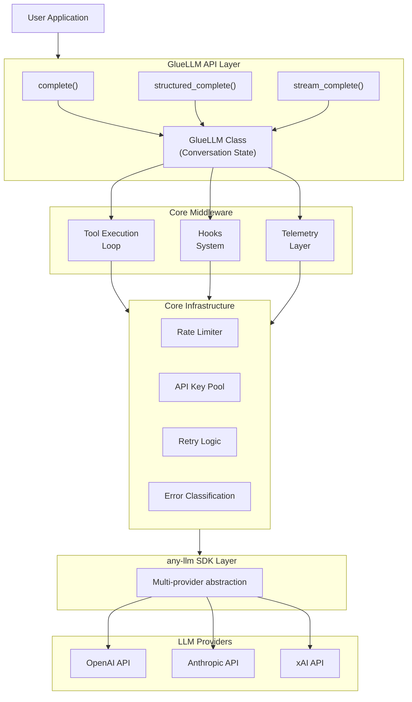

## Core Components

### 1. API Layer (`gluellm/api.py`)

The main entry point for all LLM interactions.

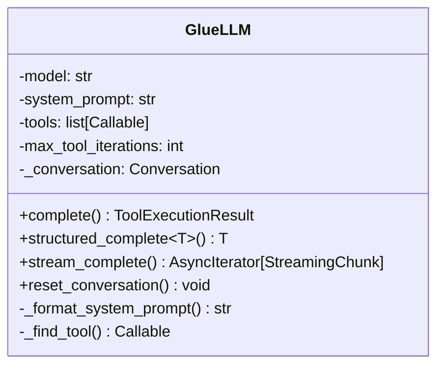

**Key Responsibilities:**
- Manage conversation state
- Execute tool calling loops
- Parse structured outputs
- Handle streaming responses

### 2. Tool Execution Loop

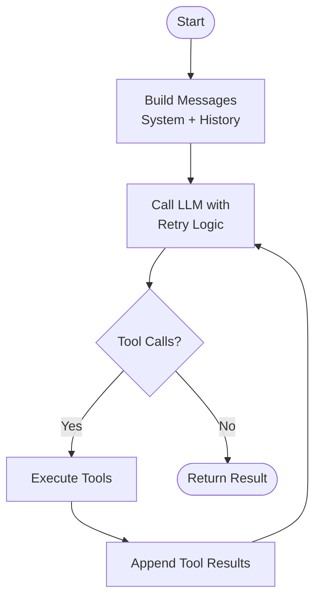

### 3. Workflow System

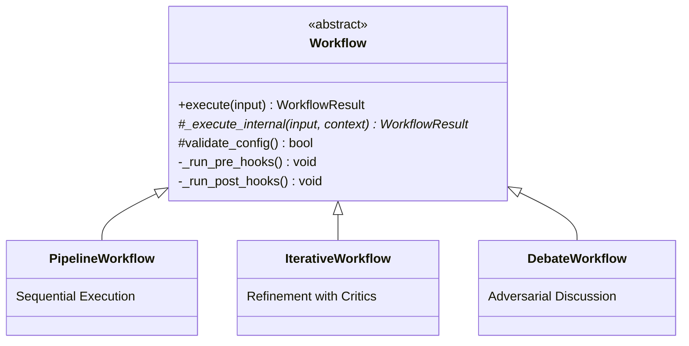

### 4. Executor System

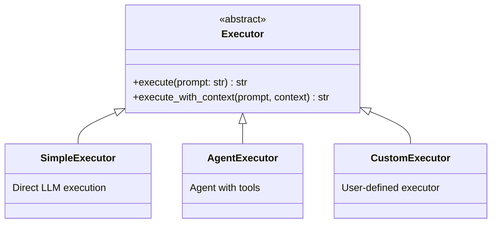

### 5. Hook System

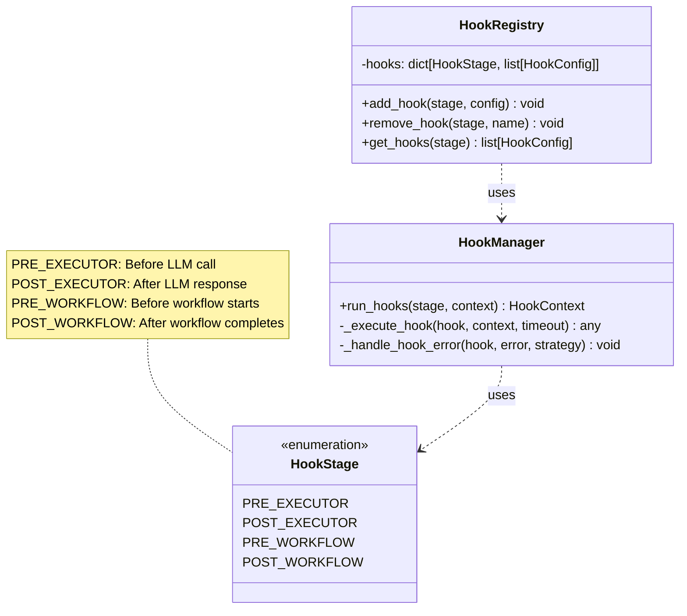

### 6. Telemetry Layer

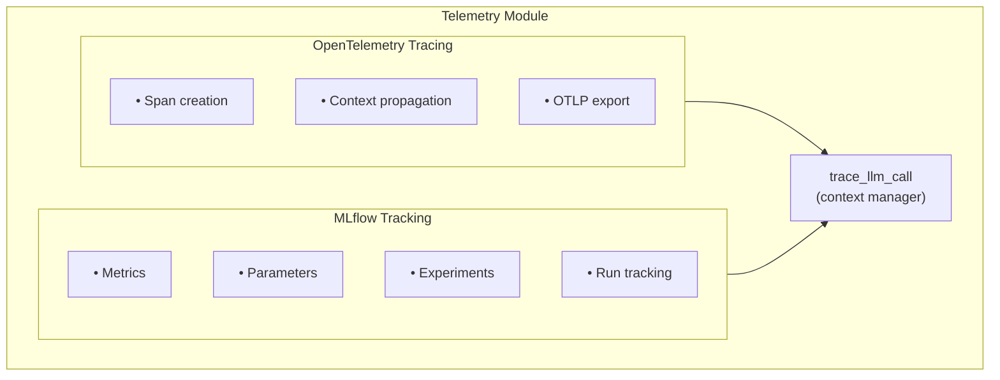

## Data Flow

### Request Flow

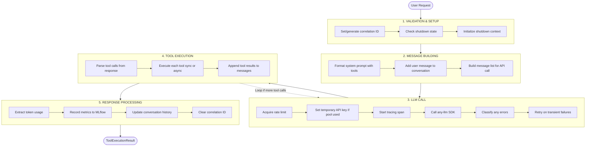

### Workflow Execution Flow

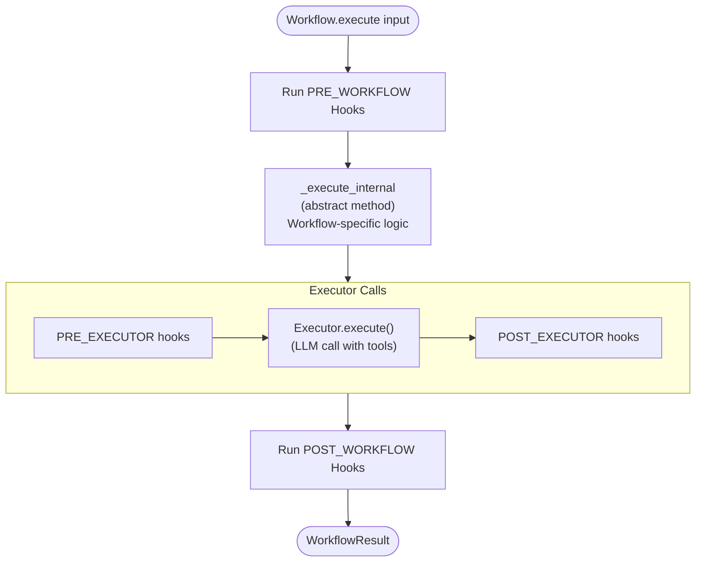

## Error Handling

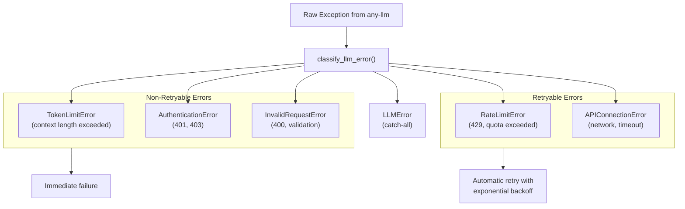

## Configuration

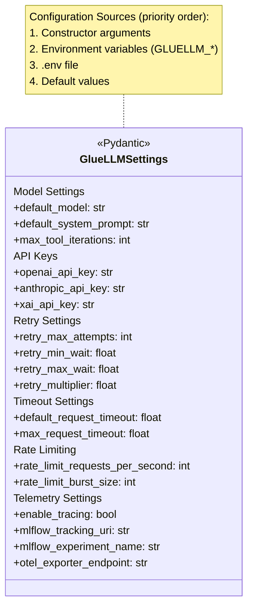

## Shutdown Handling

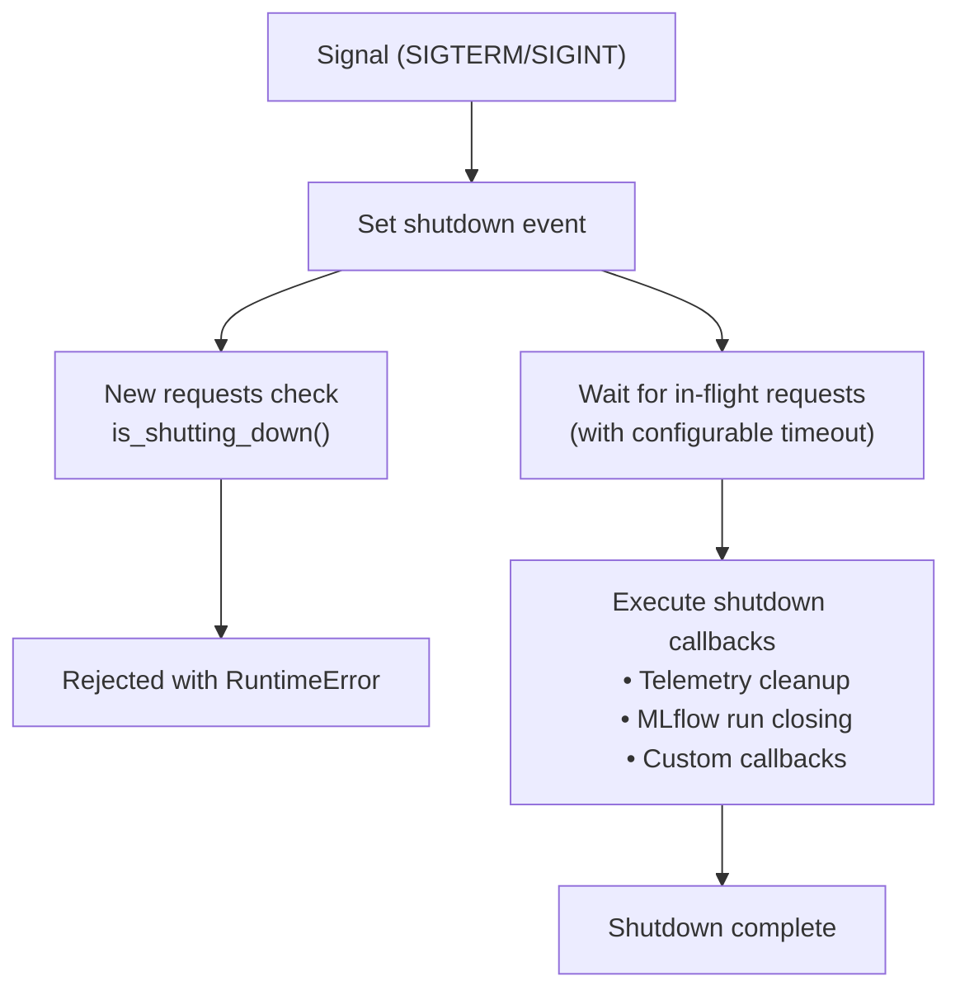

## Extension Points

### Adding New Workflows

1. Create a new file in `gluellm/workflows/`
2. Extend `Workflow` base class
3. Implement `_execute_internal()` method
4. Create config model in `gluellm/models/workflow.py`

### Adding New Hooks

1. Create hook function: `def my_hook(context: HookContext) -> HookContext`
2. Register with `HookRegistry.add_hook()`
3. Handle errors via `HookErrorStrategy`

### Adding New Providers

1. Provider support is handled by `any-llm` SDK
2. Add API key to settings/environment
3. Use model format: `provider:model_name`

## Performance Considerations

- **Rate Limiting:** Token bucket algorithm with configurable burst
- **Connection Pooling:** Handled by any-llm SDK
- **Retry Logic:** Exponential backoff with jitter
- **Parallel Execution:** Workflows use `asyncio.gather()` for parallel agent execution
- **Token Tracking:** Minimal overhead, optional MLflow integration

## Security Considerations

- **API Key Management:** Keys stored in environment or secure settings
- **PII Handling:** Use hooks for content filtering before sending to LLMs
- **Audit Logging:** Hook system supports comprehensive audit trails
- **Rate Limiting:** Prevents accidental API abuse
