# GlueLLM Architecture

This document provides a comprehensive overview of GlueLLM's architecture, including component diagrams, data flow, and design decisions.

## High-Level Overview

GlueLLM is an LLM orchestration framework that provides:
- **Unified API** for multiple LLM providers
- **Automatic tool execution** with retry logic
- **Multi-agent workflows** for complex tasks
- **Hooks system** for cross-cutting concerns
- **Observability** through logging (`gluellm.observability.logging_config`), OpenTelemetry, and MLflow

## System Architecture

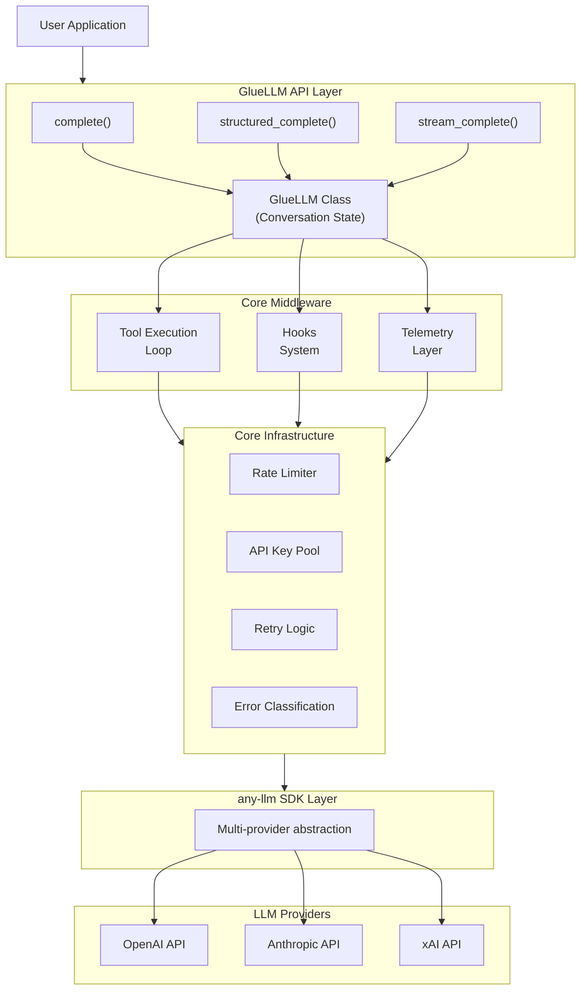
```mermaid
graph TB
    User[User Application]

    subgraph APILayer["GlueLLM API Layer"]
        complete["complete()"]
        structured["structured_complete()"]
        stream["stream_complete()"]
        GlueLLMClass["GlueLLM Class<br/>(Conversation State)"]

        complete --> GlueLLMClass
        structured --> GlueLLMClass
        stream --> GlueLLMClass
    end

    subgraph Middleware["Core Middleware"]
        ToolExec["Tool Execution<br/>Loop"]
        Hooks["Hooks<br/>System"]
        Telemetry["Telemetry<br/>Layer"]
    end

    subgraph Infrastructure["Core Infrastructure"]
        RateLimiter["Rate Limiter"]
        APIKeyPool["API Key Pool"]
        RetryLogic["Retry Logic"]
        ErrorClass["Error Classification"]
    end

    subgraph SDK["any-llm SDK Layer"]
        SDKLayer["Multi-provider abstraction"]
    end

    subgraph Providers["LLM Providers"]
        OpenAI["OpenAI API"]
        Anthropic["Anthropic API"]
        XAI["xAI API"]
    end

    User --> APILayer
    GlueLLMClass --> ToolExec
    GlueLLMClass --> Hooks
    GlueLLMClass --> Telemetry
    ToolExec --> Infrastructure
    Hooks --> Infrastructure
    Telemetry --> Infrastructure
    Infrastructure --> SDK
    SDKLayer --> OpenAI
    SDKLayer --> Anthropic
    SDKLayer --> XAI
```

## Core Components

### 1. API Layer (`gluellm/api.py`)

The main entry point for all LLM interactions.

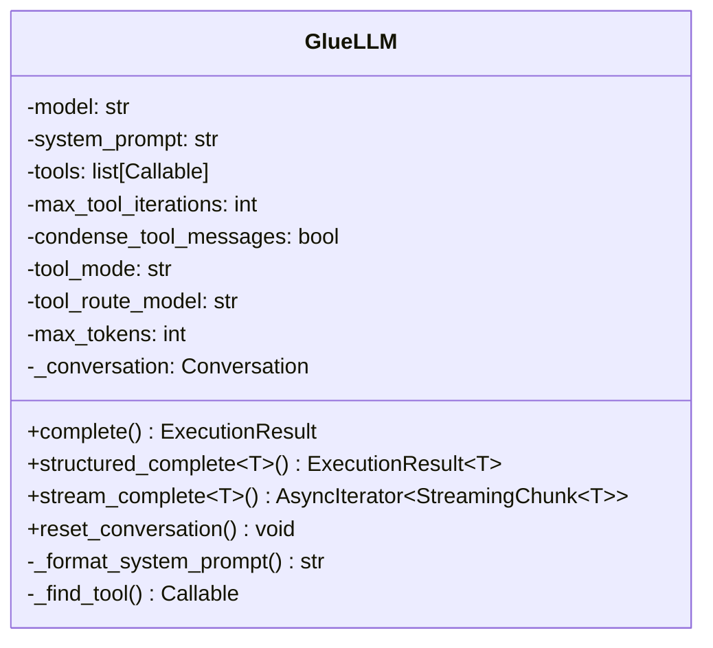
```mermaid
classDiagram
    class GlueLLM {
        -model: str
        -system_prompt: str
        -tools: list[Callable]
        -max_tool_iterations: int
        -condense_tool_messages: bool
        -tool_mode: str
        -tool_route_model: str
        -max_tokens: int
        -_conversation: Conversation
        +complete() ExecutionResult
        +structured_complete~T~() ExecutionResult~T~
        +stream_complete~T~() AsyncIterator~StreamingChunk~T~~
        +reset_conversation() void
        -_format_system_prompt() str
        -_find_tool() Callable
    }
```

**Key Responsibilities:**
- Manage conversation state
- Execute tool calling loops
- Parse structured outputs
- Handle streaming responses

### 2. Tool Execution Loop

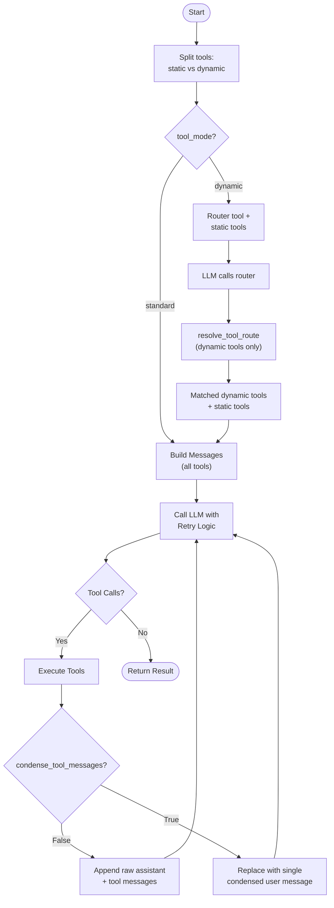
```mermaid
flowchart TD
    Start([Start]) --> Split["Split tools:\nstatic vs dynamic"]
    Split --> ToolMode{tool_mode?}
    ToolMode -->|standard| BuildMessages["Build Messages\n(all tools)"]
    ToolMode -->|dynamic| RouterStart["Router tool +\nstatic tools"]
    RouterStart --> RouterCall[LLM calls router]
    RouterCall --> MatchedSchemas["resolve_tool_route\n(dynamic tools only)"]
    MatchedSchemas --> MergeStatic["Matched dynamic tools\n+ static tools"]
    MergeStatic --> BuildMessages
    BuildMessages --> CallLLM[Call LLM with<br/>Retry Logic]
    CallLLM --> ToolCalls{Tool Calls?}
    ToolCalls -->|Yes| ExecuteTools[Execute Tools]
    ToolCalls -->|No| Return([Return Result])
    ExecuteTools --> Condense{condense_tool_messages?}
    Condense -->|False| AppendRaw[Append raw assistant<br/>+ tool messages]
    Condense -->|True| AppendCondensed[Replace with single<br/>condensed user message]
    AppendRaw --> CallLLM
    AppendCondensed --> CallLLM
```

**Static tools** (decorated with `@static_tool`) are always injected into every LLM call regardless of `tool_mode`. In dynamic mode they bypass the router and are merged back alongside whatever the router matches. In standard mode the decorator has no effect.

All three features are **opt-in and off by default**. See [TOOL_EXECUTION.md](TOOL_EXECUTION.md) for full details.

### 3. Workflow System

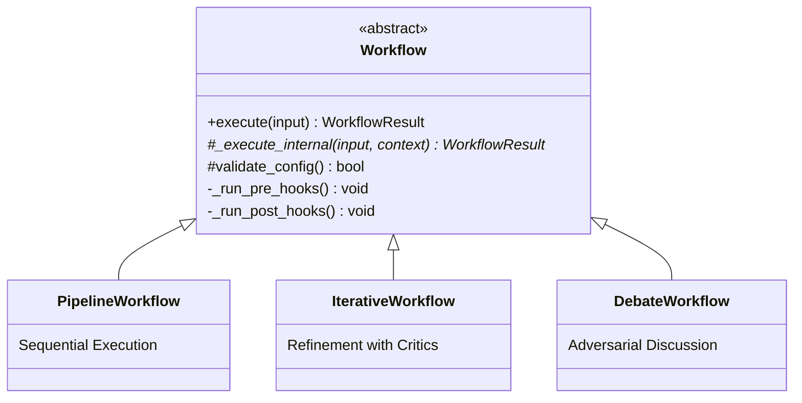
```mermaid
classDiagram
    class Workflow {
        <<abstract>>
        +execute(input) WorkflowResult
        #_execute_internal(input, context)* WorkflowResult
        #validate_config() bool
        -_run_pre_hooks() void
        -_run_post_hooks() void
    }

    class PipelineWorkflow {
        Sequential Execution
    }

    class IterativeWorkflow {
        Refinement with Critics
    }

    class DebateWorkflow {
        Adversarial Discussion
    }

    Workflow <|-- PipelineWorkflow
    Workflow <|-- IterativeWorkflow
    Workflow <|-- DebateWorkflow
```

### 4. Executor System

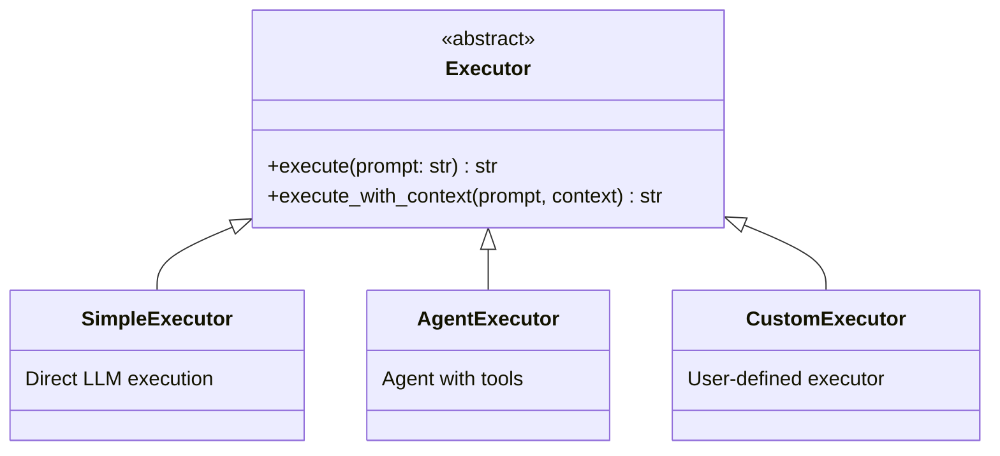
```mermaid
classDiagram
    class Executor {
        <<abstract>>
        +execute(prompt: str) str
        +execute_with_context(prompt, context) str
    }

    class SimpleExecutor {
        Direct LLM execution
    }

    class AgentExecutor {
        Agent with tools
    }

    class CustomExecutor {
        User-defined executor
    }

    Executor <|-- SimpleExecutor
    Executor <|-- AgentExecutor
    Executor <|-- CustomExecutor
```

### 5. Hook System

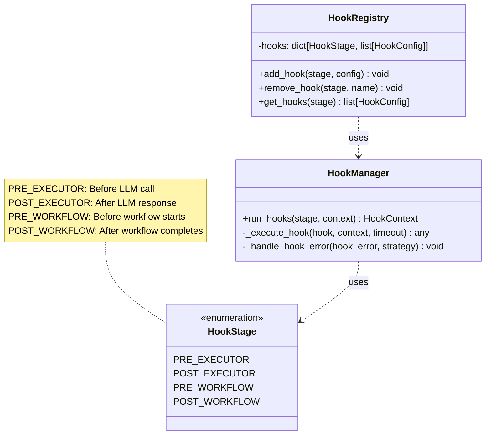
```mermaid
classDiagram
    class HookRegistry {
        -hooks: dict[HookStage, list[HookConfig]]
        +add_hook(stage, config) void
        +remove_hook(stage, name) void
        +get_hooks(stage) list[HookConfig]
    }

    class HookManager {
        +run_hooks(stage, context) HookContext
        -_execute_hook(hook, context, timeout) any
        -_handle_hook_error(hook, error, strategy) void
    }

    class HookStage {
        <<enumeration>>
        PRE_EXECUTOR
        POST_EXECUTOR
        PRE_WORKFLOW
        POST_WORKFLOW
    }

    HookRegistry ..> HookManager : uses
    HookManager ..> HookStage : uses

    note for HookStage "PRE_EXECUTOR: Before LLM call
POST_EXECUTOR: After LLM response
PRE_WORKFLOW: Before workflow starts
POST_WORKFLOW: After workflow completes"
```

### 6. Logging Configuration

Logging is provided by `gluellm.observability.logging_config`:

- **File logging**: Rotating file handler (default: `logs/gluellm.log`, 10MB max, 5 backups)
- **Console logging**: Opt-in via `GLUELLM_LOG_CONSOLE_OUTPUT=true` or `console_output=True` in `setup_logging()`. Off by default to avoid interfering with parent application logging (e.g., when used as a library).
- **Correlation IDs**: `CorrelationIDFilter` injects correlation IDs into all log records for request tracing.
- **JSON format**: Optional structured logging via `GLUELLM_LOG_JSON_FORMAT=true` for log aggregation (ELK, Datadog).
- **Disable completely**: Set `GLUELLM_DISABLE_LOGGING=true` to use only your application's logging configuration.

See `setup_logging()` and `get_logger()` docstrings for all environment variables.

### 7. Telemetry Layer

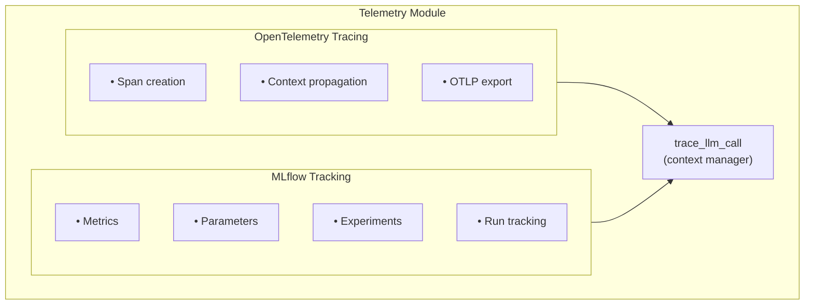
```mermaid
graph TB
    subgraph TelemetryModule["Telemetry Module"]
        subgraph OTel["OpenTelemetry Tracing"]
            SpanCreation["• Span creation"]
            ContextProp["• Context propagation"]
            OTLPExport["• OTLP export"]
        end

        subgraph MLflow["MLflow Tracking"]
            Metrics["• Metrics"]
            Parameters["• Parameters"]
            Experiments["• Experiments"]
            RunTracking["• Run tracking"]
        end

        TraceLLMCall["trace_llm_call<br/>(context manager)"]

        OTel --> TraceLLMCall
        MLflow --> TraceLLMCall
    end
```

## Data Flow

### Request Flow

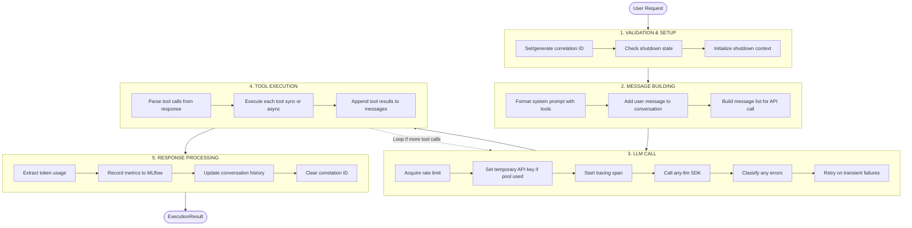
```mermaid
flowchart TD
    Start([User Request])

    subgraph Stage1["1. VALIDATION & SETUP"]
        V1[Set/generate correlation ID]
        V2[Check shutdown state]
        V3[Initialize shutdown context]
        V1 --> V2 --> V3
    end

    subgraph Stage2["2. MESSAGE BUILDING"]
        M1[Format system prompt with tools]
        M2[Add user message to conversation]
        M3[Build message list for API call]
        M1 --> M2 --> M3
    end

    subgraph Stage3["3. LLM CALL"]
        L1[Acquire rate limit]
        L2[Set temporary API key if pool used]
        L3[Start tracing span]
        L4[Call any-llm SDK]
        L5[Classify any errors]
        L6[Retry on transient failures]
        L1 --> L2 --> L3 --> L4 --> L5 --> L6
    end

    subgraph Stage4["4. TOOL EXECUTION"]
        T1[Parse tool calls from response]
        T2[Execute each tool sync or async]
        T3[Append tool results to messages]
        T1 --> T2 --> T3
    end

    subgraph Stage5["5. RESPONSE PROCESSING"]
        R1[Extract token usage]
        R2[Record metrics to MLflow]
        R3[Update conversation history]
        R4[Clear correlation ID]
        R1 --> R2 --> R3 --> R4
    end

    Start --> Stage1
    Stage1 --> Stage2
    Stage2 --> Stage3
    Stage3 --> Stage4
    Stage4 --> Stage5
    Stage5 --> End([ExecutionResult])

    Stage4 -.->|Loop if more tool calls| Stage3
```

### Workflow Execution Flow

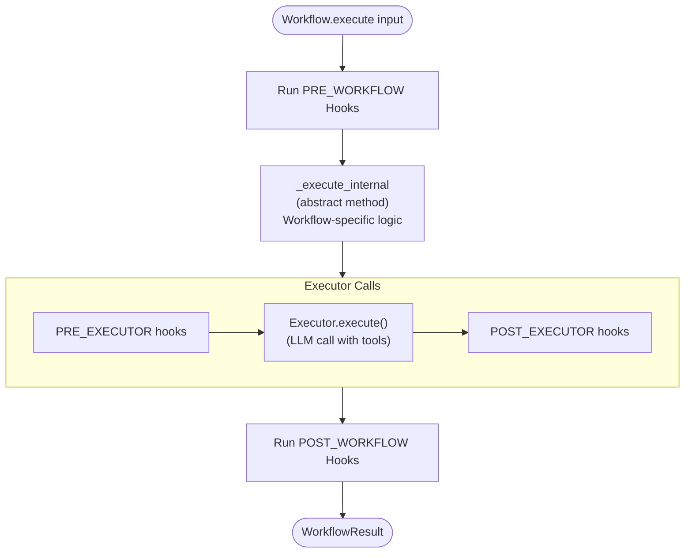
```mermaid
flowchart TD
    Start([Workflow.execute input])

    Start --> PreWorkflow["Run PRE_WORKFLOW Hooks"]

    PreWorkflow --> ExecuteInternal["_execute_internal
    (abstract method)
    Workflow-specific logic"]

    ExecuteInternal --> ExecutorCalls["Executor Calls"]

    subgraph ExecutorCalls["Executor Calls"]
        PreExecutor["PRE_EXECUTOR hooks"]
        Execute["Executor.execute()
        (LLM call with tools)"]
        PostExecutor["POST_EXECUTOR hooks"]

        PreExecutor --> Execute
        Execute --> PostExecutor
    end

    ExecutorCalls --> PostWorkflow["Run POST_WORKFLOW Hooks"]

    PostWorkflow --> End([WorkflowResult])
```

## Error Handling

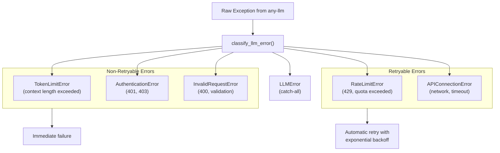
```mermaid
flowchart TD
    RawException["Raw Exception from any-llm"]

    RawException --> Classify["classify_llm_error()"]

    Classify --> TokenLimit["TokenLimitError
    (context length exceeded)"]
    Classify --> RateLimit["RateLimitError
    (429, quota exceeded)"]
    Classify --> APIConnection["APIConnectionError
    (network, timeout)"]
    Classify --> Authentication["AuthenticationError
    (401, 403)"]
    Classify --> InvalidRequest["InvalidRequestError
    (400, validation)"]
    Classify --> LLMError["LLMError
    (catch-all)"]

    subgraph Retryable["Retryable Errors"]
        RateLimit
        APIConnection
    end

    subgraph NonRetryable["Non-Retryable Errors"]
        TokenLimit
        Authentication
        InvalidRequest
    end

    Retryable --> Retry["Automatic retry with
    exponential backoff"]
    NonRetryable --> Fail["Immediate failure"]
```

## Configuration

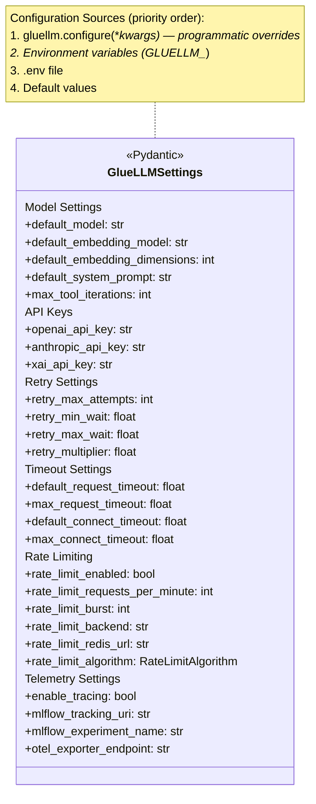
```mermaid
classDiagram
    class GlueLLMSettings {
        <<Pydantic>>

        Model Settings
        +default_model: str
        +default_embedding_model: str
        +default_embedding_dimensions: int
        +default_system_prompt: str
        +max_tool_iterations: int

        API Keys
        +openai_api_key: str
        +anthropic_api_key: str
        +xai_api_key: str

        Retry Settings
        +retry_max_attempts: int
        +retry_min_wait: float
        +retry_max_wait: float
        +retry_multiplier: float

        Timeout Settings
        +default_request_timeout: float
        +max_request_timeout: float
        +default_connect_timeout: float
        +max_connect_timeout: float

        Rate Limiting
        +rate_limit_enabled: bool
        +rate_limit_requests_per_minute: int
        +rate_limit_burst: int
        +rate_limit_backend: str
        +rate_limit_redis_url: str
        +rate_limit_algorithm: RateLimitAlgorithm

        Telemetry Settings
        +enable_tracing: bool
        +mlflow_tracking_uri: str
        +mlflow_experiment_name: str
        +otel_exporter_endpoint: str
    }

    note for GlueLLMSettings "Configuration Sources (priority order):
    1. gluellm.configure(**kwargs) — programmatic overrides
    2. Environment variables (GLUELLM_*)
    3. .env file
    4. Default values"
```

## Programmatic Configuration

In addition to environment variables and `.env` files, settings can be applied at runtime with `gluellm.configure()`. This is especially useful for library consumers that manage their own Pydantic settings or need multiple configurations without filesystem side-effects.

```python
import gluellm
from gluellm import RateLimitAlgorithm

# Call once at application startup, before making any LLM calls.
# Kwargs are merged on top of whatever env vars / .env already resolved.
gluellm.configure(
    default_model="anthropic:claude-3-5-sonnet-20241022",
    rate_limit_backend="redis",
    rate_limit_redis_url="redis://localhost:6379",
    rate_limit_algorithm=RateLimitAlgorithm.LEAKING_BUCKET,
    openai_api_key=my_settings.openai_key,
)
```

`configure()` mutates the global `settings` singleton **in place**, so all internal modules (`rate_limiter`, `api`, `embeddings`, etc.) pick up the new values immediately without requiring a restart or re-import.

### Rate Limiting Configuration

Rate limiting supports five algorithms (backed by [throttled-py](https://pypi.org/project/throttled-py/)) and two storage backends.

| Setting | Env var | Default | Description |
|---|---|---|---|
| `rate_limit_enabled` | `GLUELLM_RATE_LIMIT_ENABLED` | `True` | Enable/disable rate limiting |
| `rate_limit_requests_per_minute` | `GLUELLM_RATE_LIMIT_REQUESTS_PER_MINUTE` | `60` | Global RPM cap |
| `rate_limit_burst` | `GLUELLM_RATE_LIMIT_BURST` | `10` | Burst allowance |
| `rate_limit_backend` | `GLUELLM_RATE_LIMIT_BACKEND` | `"memory"` | `"memory"` or `"redis"` |
| `rate_limit_redis_url` | `GLUELLM_RATE_LIMIT_REDIS_URL` | `None` | Redis connection URL (required for redis backend) |
| `rate_limit_algorithm` | `GLUELLM_RATE_LIMIT_ALGORITHM` | `"sliding_window"` | See `RateLimitAlgorithm` below |

**`RateLimitAlgorithm` enum values:**

| Enum | String value | Description |
|---|---|---|
| `FIXED_WINDOW` | `"fixed_window"` | Counts requests in fixed time windows |
| `SLIDING_WINDOW` | `"sliding_window"` | Rolling window — smoother than fixed (default) |
| `LEAKING_BUCKET` | `"leaking_bucket"` | Constant outflow, absorbs bursts |
| `TOKEN_BUCKET` | `"token_bucket"` | Tokens refill at a fixed rate |
| `GCRA` | `"gcra"` | Generic Cell Rate Algorithm — low jitter |

**Per-call and per-client overrides** via `RateLimitConfig`:

```python
from gluellm import GlueLLM, RateLimitConfig, RateLimitAlgorithm

# Client-level default (applies to all calls from this instance)
client = GlueLLM(
    rate_limit_config=RateLimitConfig(algorithm=RateLimitAlgorithm.LEAKING_BUCKET)
)

# Per-call override (highest priority)
result = await client.complete(
    "Hello",
    rate_limit_config=RateLimitConfig(algorithm=RateLimitAlgorithm.TOKEN_BUCKET),
)

# Shorthand for algorithm-only overrides
result = await client.complete(
    "Hello",
    rate_limit_algorithm=RateLimitAlgorithm.GCRA,
)
```

Priority order (highest → lowest): per-call `rate_limit_config` → per-call `rate_limit_algorithm` → client-level `rate_limit_config` → `gluellm.configure()` / env vars.

## Shutdown Handling

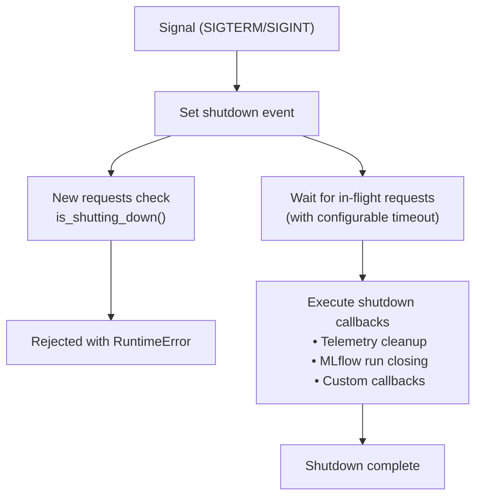
```mermaid
flowchart TD
    Signal["Signal (SIGTERM/SIGINT)"]

    Signal --> SetEvent["Set shutdown event"]

    SetEvent --> CheckRequests["New requests check
    is_shutting_down()"]

    CheckRequests --> Reject["Rejected with RuntimeError"]

    SetEvent --> WaitInflight["Wait for in-flight requests
    (with configurable timeout)"]

    WaitInflight --> ExecuteCallbacks["Execute shutdown callbacks
    • Telemetry cleanup
    • MLflow run closing
    • Custom callbacks"]

    ExecuteCallbacks --> Complete["Shutdown complete"]
```

## Extension Points

### Adding New Workflows

1. Create a new file in `gluellm/workflows/`
2. Extend `Workflow` base class
3. Implement `_execute_internal()` method
4. Create config model in `gluellm/models/workflow.py`

### Adding New Hooks

1. Create hook function: `def my_hook(context: HookContext) -> HookContext`
2. Register with `HookRegistry.add_hook()`
3. Handle errors via `HookErrorStrategy`

### Adding New Providers

1. Provider support is handled by `any-llm` SDK
2. Add API key to settings/environment
3. Use model format: `provider:model_name`

## Performance Considerations

- **Rate Limiting:** Five algorithms (sliding window, fixed window, leaking bucket, token bucket, GCRA) via `throttled-py`. Memory or Redis backend. Configurable globally via `gluellm.configure()` or per-call via `RateLimitConfig`.
- **Connection Pooling:** Handled by any-llm SDK; providers are cached so the same httpx client and connection pool are reused across calls
- **Dual Timeouts:** `connect_timeout` is enforced at the httpx transport layer; `request_timeout` is an `asyncio.wait_for` guard over the full coroutine. Both default to configurable settings and are clamped to per-setting maximums. See [CONFIGURATION.md](CONFIGURATION.md).
- **Retry Logic:** Exponential backoff with jitter. For per-call and per-client customisation (`RetryConfig`, `retry_on`, callback), see [ERROR_HANDLING.md](ERROR_HANDLING.md).
- **Parallel Execution:** Workflows use `asyncio.gather()` for parallel agent execution
- **Token Tracking:** Minimal overhead, optional MLflow integration
- **Context Condensing** *(opt-in)*: each completed tool round collapsed to 1 message, preventing linear context growth in long chains. Enable with `condense_tool_messages=True`.
- **Dynamic Tool Routing** *(opt-in)*: only inject schemas for tools the model actually needs, reducing per-call prompt tokens for large toolsets. Enable with `tool_mode="dynamic"`.
- **Static Tool Pinning** *(opt-in)*: individual tools can be decorated with `@static_tool` to bypass dynamic routing and remain available in every LLM call. Useful for utility tools (timestamps, user context) that should always be in scope.

See [TOOL_EXECUTION.md](TOOL_EXECUTION.md) and [PERFORMANCE.md](PERFORMANCE.md) for usage guidance.

## Security Considerations

- **API Key Management:** Keys stored in environment or secure settings
- **PII Handling:** Use hooks for content filtering before sending to LLMs
- **Audit Logging:** Hook system supports comprehensive audit trails
- **Rate Limiting:** Prevents accidental API abuse
