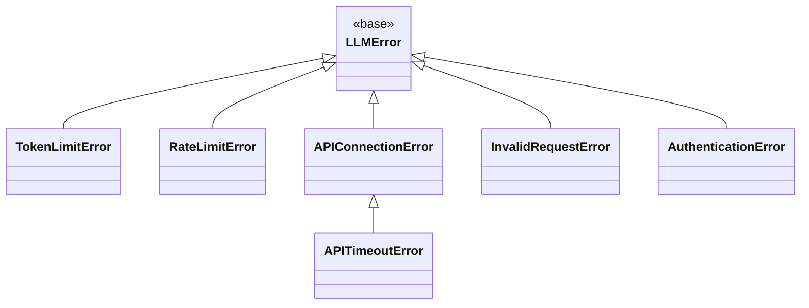

# GlueLLM Error Handling

GlueLLM provides a consistent exception hierarchy and automatic retry logic for LLM API calls.

## Exception Hierarchy



### Exception Types

| Exception | When Raised |
|-----------|-------------|
| `LLMError` | Base class; generic LLM errors |
| `TokenLimitError` | Context length exceeded, token limit exceeded |
| `RateLimitError` | 429, quota exceeded, rate limit hit |
| `APIConnectionError` | Network issues, 502, 503, 504 |
| `APITimeoutError` | Request timed out (subclass of `APIConnectionError`) |
| `InvalidRequestError` | Bad params, validation errors, 400 |
| `AuthenticationError` | 401, 403, invalid API key |

### Guardrail Exceptions

| Exception | When Raised |
|-----------|-------------|
| `GuardrailBlockedError` | Input guardrails block the request; no retry |
| `GuardrailRejectedError` | Output guardrails reject content; triggers retry |

## Error Classification

Raw exceptions from the underlying API (any-llm) are classified via `classify_llm_error()` into GlueLLM exception types. Classification uses error message text and exception type.

## Retry Logic

### Retryable vs Non-Retryable

| Retryable | Non-Retryable |
|-----------|---------------|
| `RateLimitError` | `TokenLimitError` |
| `APIConnectionError` | `AuthenticationError` |
| | `InvalidRequestError` |

### Default Behavior

- **Retries**: Up to 3 attempts (configurable via `RetryConfig` or `GLUELLM_RETRY_MAX_ATTEMPTS`)
- **Backoff**: Exponential with jitter between `min_wait` and `max_wait`
- **Only on**: `RateLimitError` and `APIConnectionError`

### RetryConfig

```python
from gluellm import RetryConfig, GlueLLM

# Disable retries entirely
client = GlueLLM(retry_config=RetryConfig(retry_enabled=False))

# Custom retry limits
client = GlueLLM(retry_config=RetryConfig(
    max_attempts=5,
    min_wait=1.0,
    max_wait=60.0,
    multiplier=2.0,
))

# Per-call override
result = await client.complete("Hello", retry_config=RetryConfig(retry_enabled=False))
```

### Custom Retry with retry_on

Restrict retries to specific exception types:

```python
from gluellm import RetryConfig, RateLimitError

client = GlueLLM(retry_config=RetryConfig(
    retry_on=[RateLimitError],  # Only retry on rate limit, not connection errors
))
```

### Custom Retry with Callback

Full control over retry decisions and per-attempt parameters:

```python
async def my_retry_callback(error: Exception, attempt: int) -> tuple[bool, dict | None]:
    if attempt >= 2:
        return False, None  # Stop retrying
    # Lower temperature on retry
    return True, {"temperature": 0.3}

client = GlueLLM(retry_config=RetryConfig(
    callback=my_retry_callback,
))
```

Callback signature: `(error, attempt) -> (should_retry, next_params | None)`.
- `should_retry`: `False` stops retrying and re-raises
- `next_params`: Merged into model kwargs for next attempt; `None` keeps current params

## Handling Errors in Your Code

```python
from gluellm import complete
from gluellm.api import (
    LLMError,
    TokenLimitError,
    RateLimitError,
    APIConnectionError,
    InvalidRequestError,
    AuthenticationError,
)

async def safe_complete():
    try:
        result = await complete("Hello")
        return result.final_response
    except TokenLimitError as e:
        # Reduce context or split input
        log.error("Context too long: %s", e)
        raise
    except RateLimitError as e:
        # Wait and retry, or use API key pool
        log.warning("Rate limited: %s", e)
        raise
    except AuthenticationError as e:
        # Check API key configuration
        log.error("Auth failed: %s", e)
        raise
    except InvalidRequestError as e:
        # Fix request parameters
        log.error("Invalid request: %s", e)
        raise
    except LLMError as e:
        # Catch-all for other LLM errors
        log.error("LLM error: %s", e)
        raise
```

## Shutdown Handling

When `is_shutting_down()` is True (e.g., SIGTERM received), new requests raise `RuntimeError`:

```python
RuntimeError: Cannot process request: shutdown in progress
```

Complete in-flight requests before shutdown. See [RUNTIME.md](RUNTIME.md) for details.

## See Also

- [API.md](API.md) - API reference
- [CONFIGURATION.md](CONFIGURATION.md) - Retry and timeout settings
- [RUNTIME.md](RUNTIME.md) - Graceful shutdown
