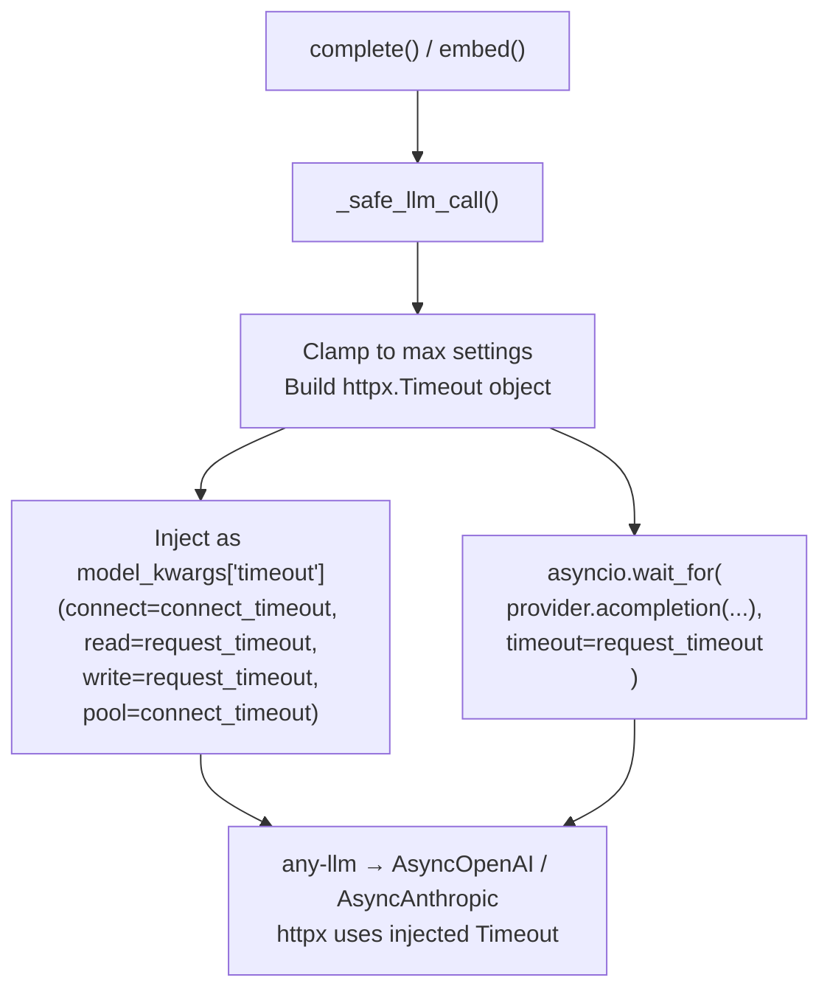

# Timeouts

GlueLLM has two independent, configurable timeouts for every LLM and embedding call:

| Timeout | Governs | Default | Env var |
|---------|---------|---------|---------|
| `connect_timeout` | TCP connection establishment | 10s | `GLUELLM_DEFAULT_CONNECT_TIMEOUT` |
| `request_timeout` | Full round-trip (send + receive) | 60s | `GLUELLM_DEFAULT_REQUEST_TIMEOUT` |

Both are enforced in parallel: `connect_timeout` is applied at the httpx transport layer (fires if the server doesn't accept the connection in time), while `request_timeout` is an `asyncio.wait_for` guard over the entire coroutine (fires if the full response — including token generation — takes too long).

## What errors each raises

| Situation | Exception |
|-----------|-----------|
| Connection not established in time | `APIConnectionError` (classified from `httpx.ConnectTimeout`) |
| Full request exceeds `request_timeout` | `APITimeoutError` (subclass of `APIConnectionError`) |

Both are retried by default. See [ERROR_HANDLING.md](ERROR_HANDLING.md) and [RETRY.md](RETRY.md).

---

## Per-call usage

Pass either or both to any completion or embedding function:

```python
from gluellm import complete, structured_complete, stream_complete, embed

# Both explicit
result = await complete(
    "Write a detailed report on climate change.",
    request_timeout=180.0,   # allow 3 minutes for a long generation
    connect_timeout=5.0,     # fail fast if the API is unreachable
)

# Only request_timeout — connect_timeout uses its default (10s)
result = await complete("Quick question.", request_timeout=30.0)

# Structured output
from pydantic import BaseModel

class Summary(BaseModel):
    title: str
    points: list[str]

result = await structured_complete(
    "Summarise this article...",
    response_format=Summary,
    request_timeout=90.0,
    connect_timeout=8.0,
)

# Streaming
async for chunk in stream_complete(
    "Tell me a long story.",
    request_timeout=300.0,
):
    print(chunk.content, end="", flush=True)

# Embeddings
result = await embed("Hello world", request_timeout=30.0, connect_timeout=5.0)
```

---

## Per-client usage

Set timeouts on the `GlueLLM` client to use them for every method call:

```python
from gluellm import GlueLLM

# These are passed per-call — there are no instance-level defaults on GlueLLM.
# Pass them to each method you call on the client.
client = GlueLLM(model="openai:gpt-4o-mini")

result = await client.complete(
    "Hello",
    request_timeout=60.0,
    connect_timeout=10.0,
)

result = await client.structured_complete(
    "Extract the names.",
    response_format=MyModel,
    request_timeout=60.0,
    connect_timeout=10.0,
)
```

---

## Global defaults via environment variables

Override the defaults across all calls without changing application code:

```bash
# .env or shell
GLUELLM_DEFAULT_REQUEST_TIMEOUT=120     # 2 minutes
GLUELLM_DEFAULT_CONNECT_TIMEOUT=15      # 15 seconds
```

Hard caps prevent runaway values passed by callers:

```bash
GLUELLM_MAX_REQUEST_TIMEOUT=600         # no call may exceed 10 minutes
GLUELLM_MAX_CONNECT_TIMEOUT=60         # no connect timeout may exceed 60s
```

| Env var | Default | Description |
|---------|---------|-------------|
| `GLUELLM_DEFAULT_REQUEST_TIMEOUT` | `60.0` | Default request timeout in seconds |
| `GLUELLM_MAX_REQUEST_TIMEOUT` | `300.0` | Hard cap on request timeout (5 minutes) |
| `GLUELLM_DEFAULT_CONNECT_TIMEOUT` | `10.0` | Default connection timeout in seconds |
| `GLUELLM_MAX_CONNECT_TIMEOUT` | `60.0` | Hard cap on connection timeout |

If a caller passes a value exceeding the max, it is silently clamped to the max. This prevents a single misconfigured call from hanging indefinitely.

---

## How enforcement works internally



The `httpx.Timeout` object is injected into the provider SDK's model kwargs so that httpx enforces `connect_timeout` at the transport layer. The `asyncio.wait_for` wrapping the entire coroutine is the backstop for `request_timeout`.

---

## Choosing values

| Scenario | Suggested values |
|----------|-----------------|
| Fast queries (Q&A, classification) | `request_timeout=30`, `connect_timeout=5` |
| Long generations (reports, stories) | `request_timeout=180–300`, `connect_timeout=10` |
| Batch processing where failures are expected | Keep defaults; let retry handle transient failures |
| Latency-sensitive paths | `connect_timeout=3–5` to detect unreachable APIs quickly |
| Streaming long outputs | Increase `request_timeout` — the timer covers the full stream |

---

## See also

- [ERROR_HANDLING.md](ERROR_HANDLING.md) — `APITimeoutError`, `APIConnectionError`, exception hierarchy
- [RETRY.md](RETRY.md) — how retries interact with timeout errors
