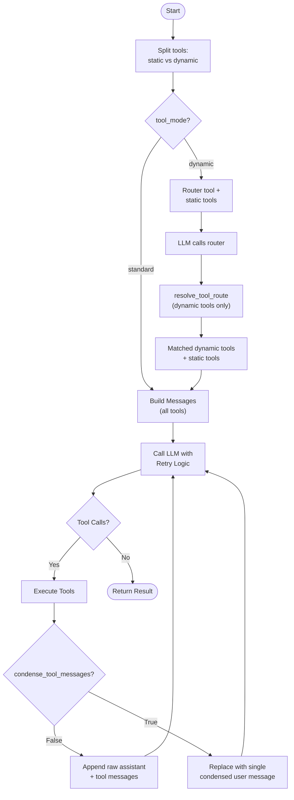

# GlueLLM Tool Execution

GlueLLM executes LLM tool/function calls automatically in a loop until the model produces a final response or the iteration limit is reached.

## Tool Modes

### standard (default)

All tool schemas are injected into every LLM call. Simple and predictable; best for small toolsets or when most tools are used on every request.

```python
client = GlueLLM(tools=[get_weather, search_db], tool_mode="standard")
# Every call includes both tools
```

### dynamic

Only a lightweight router tool is exposed on the first turn. A fast model decides which tools are needed; only those schemas are then injected. Reduces token usage for large toolsets where each request uses a small subset.

```python
client = GlueLLM(
    tools=[get_weather, search_db, send_email, get_time],
    tool_mode="dynamic",
    tool_route_model="openai:gpt-5.4-2026-03-05",  # Fast model for routing
)
# First: router selects tools; then: only selected tools in context
```

Flow:

1. User message + router tool + static tools (if any)
2. LLM calls router with user context
3. `resolve_tool_route()` returns matched tools
4. Matched tools + static tools are injected
5. Main LLM call proceeds with reduced tool set

## Static Tools (@static_tool)

In dynamic mode, some tools should always be in scope regardless of routing (e.g., time, user context). Decorate them with `@static_tool`:

```python
from gluellm import static_tool
from datetime import datetime

@static_tool
def get_current_time() -> str:
    """Get the current UTC time."""
    return datetime.utcnow().isoformat()

def search_products(query: str) -> list[str]:
    """Search the product catalog."""
    ...

client = GlueLLM(
    tools=[get_current_time, search_products],
    tool_mode="dynamic",
)
# get_current_time is always injected; search_products goes through routing
```

In `tool_mode="standard"`, `@static_tool` has no effect; all tools are already always available.

## Tool Execution Order

| Order | Description |
|-------|-------------|
| `sequential` (default) | Execute tool calls one after another |
| `parallel` | Execute multiple tool calls in parallel with `asyncio.gather` |

```python
client = GlueLLM(
    tools=[tool_a, tool_b, tool_c],
    tool_execution_order="parallel",  # Faster when model requests multiple tools
)
```

## Tool Definition

Tools are plain Python functions. Docstrings and type hints define the schema:

```python
def get_weather(location: str, unit: str = "celsius") -> str:
    """Get the current weather for a location.

    Args:
        location: City or place name
        unit: Temperature unit (celsius or fahrenheit)
    """
    return f"Weather in {location}: 22°{unit[0].upper()}"
```

Async tools are supported:

```python
async def fetch_data(url: str) -> str:
    """Fetch data from a URL."""
    async with aiohttp.ClientSession() as session:
        async with session.get(url) as resp:
            return await resp.text()
```

## Context Optimization

### condense_tool_messages

When `True`, each completed tool-call round is replaced with a single condensed message. Reduces context size in long tool loops.

```python
client = GlueLLM(
    tools=[...],
    condense_tool_messages=True,
)
```

### max_tool_iterations

Maximum number of tool-call rounds (default: 10). Prevents infinite loops.

```python
client = GlueLLM(tools=[...], max_tool_iterations=5)
```

## Execution Flow



## execute_tools

Disable tool execution to get raw tool calls without running them:

```python
result = await complete(
    "What's the weather?",
    tools=[get_weather],
    execute_tools=False,
)
# result.final_response may include tool call requests; tools not executed
```

## ToolExecutionResult

`ExecutionResult` includes:

| Field | Description |
|-------|-------------|
| `tool_calls_made` | Total number of tool calls |
| `tool_execution_history` | List of `{name, arguments, result}` per call |

## See Also

- [ARCHITECTURE.md](ARCHITECTURE.md) - Tool execution in overall architecture
- [API.md](API.md) - complete(), structured_complete() parameters
